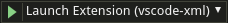

# How to Contribute

Contributions are essential for keeping this extension great. We try to keep it as easy as possible to contribute changes and we are open to suggestions for making it even easier. There are only a few guidelines that we need contributors to follow.

## Development

### Installation Prerequisites:

  * latest [Visual Studio Code](https://code.visualstudio.com/)
  * [Node.js](https://nodejs.org/) v4.0.0 or higher
  * [JDK 8+](http://www.oracle.com/technetwork/java/javase/downloads/index.html)
  * [Maven](https://maven.apache.org/)

### Steps
1. Fork and clone this repository
   
2. Fork and clone the [LemMinX - XML Language Server ](https://github.com/eclipse/lemminx)

* **Note:** The directory format has to match the following:

  ```
    YOUR_FOLDER/
              ├──── lemminx/
              │      
              ├──── vscode-xml/
  ```

3. `cd lemminx/`

4. Install the maven dependencies Mac/Linux:
	```bash
	$ ./mvnw verify
	```
	or for Windows:
	```bash
	$ mvnw.cmd verify
	```
       

5. `cd vscode-xml/`
   
6. Install the dependencies:  
	```bash  
	$ npm install
	```

7. In `vscode-xml/`, build the server by running:

	```bash   
	$ npm run build-server
	```

8. To run the extension, open the Debugging tab in VSCode.
9. Select and run 'Launch Extension (vscode-xml)' at the top left:

    
