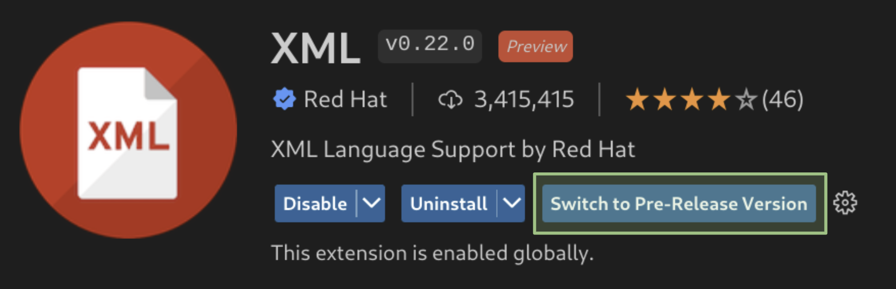

# XML Language Support by Red Hat

### [**NO LONGER REQUIRES JAVA!**](#Requirements) *since v0.15.0*

## Description

This VS Code extension provides support for creating and editing XML documents, based on the [LemMinX XML Language Server](https://github.com/eclipse/lemminx).

## Features

| Regular font       | *Italics* font                              |
| ------------------ | ------------------------------------------- |
| enabled by default | requires additional configuration to enable |

- * [XML References features](https://github.com/redhat-developer/vscode-xml/blob/main/docs/Features/XMLReferencesFeatures.md#xml-references-features) (since v0.24.0)
  * [RelaxNG (experimental) support](https://github.com/redhat-developer/vscode-xml/blob/main/docs/Features/RelaxNGFeatures.md#relaxng-features) (since v0.22.0)
  * [Surround with Tags, Comments, CDATA](https://github.com/redhat-developer/vscode-xml/blob/main/docs/Refactor.md#refactor) (since v0.23.0)
  * Syntax error reporting
  * General code completion
  * [Auto-close tags](https://github.com/redhat-developer/vscode-xml/blob/main/docs/Features/XMLFeatures.md#xml-tag-auto-close)
  * Automatic node indentation
  * Symbol highlighting
  * Document folding
  * Document links
  * [Document symbols and outline](https://github.com/redhat-developer/vscode-xml/blob/main/docs/Symbols.md)
  * [Renaming support](https://github.com/redhat-developer/vscode-xml/blob/main/docs/Features/XMLFeatures.md#rename-tag)
  * *[Automatic Tag Renaming](https://github.com/redhat-developer/vscode-xml/blob/main/docs/Features/XMLFeatures.md#auto-rename-tag) when `editor.linkedEditing` is enabled*
  * [Document Formatting](https://github.com/redhat-developer/vscode-xml/blob/main/docs/Formatting.md)
  * [DTD validation](https://github.com/redhat-developer/vscode-xml/blob/main/docs/Validation.md#validation-with-dtd-grammar)
  * DTD completion
  * DTD formatting
  * [XSD validation](https://github.com/redhat-developer/vscode-xml/blob/main/docs/Validation.md#validation-with-xsd-grammar)
  * XSD based hover
  * XSD based code completion
  * XSL support
  * [XInclude support](https://github.com/redhat-developer/vscode-xml/blob/main/docs/Features/XIncludeFeatures.md#Validation)
  * [XML catalogs](https://github.com/redhat-developer/vscode-xml/blob/main/docs/Features/XMLCatalogFeatures.md#xml-catalog-features)
  * File associations
  * Code actions
  * Schema Caching

See the [changelog](CHANGELOG.md) for the latest release.

You might also find useful information in the [Online XML Documentation](https://github.com/redhat-developer/vscode-xml/blob/main/docs/README.md)
or you can read this documentation inside vscode with the command `Open XML Document` available with `Ctrl+Shift+P`:

## Requirements

For running the binary version:
  * Windows, macOS, or Linux, on a x86_64 CPU
    * We do not make a binary specific for Apple ARM (Apple Silicon), but the x86_64 binary seems to work through the Rosetta 2 translation layer.
    * We do not currently support running on Linux installations without `libc` present
  * Java is not required for this version
  * The binary is automatically downloaded by vscode-xml if it is needed, with no additional action required on the part of the user.

For running the Java version (required if you want to run [extensions](./docs/Extensions.md#custom-xml-extensions) to the base XML features):
  * Java JDK (or JRE) 8 or more recent
  * Ensure Java path is set in either:
    * `xml.java.home` in VSCode preferences
    * `java.home` in VSCode preferences
    * Environment variable `JAVA_HOME` or `JDK_HOME`
    * **Note**: The path should end at the parent folder that contains the `bin` folder.
      **Example Path**: `/usr/lib/jvm/java-1.8.0` if `bin` exists at `/usr/lib/jvm/java-1.8.0/bin`.
    * **Note**: If the path is not set, the extension will attempt to find the path to the JDK or JRE.

See [how to set java home](https://github.com/redhat-developer/vscode-xml/blob/main/docs/Preferences.md#java-home) for more information how this extension searches for Java.

## Supported VS Code settings

The following settings are supported:

* [`xml.java.home`](https://github.com/redhat-developer/vscode-xml/blob/main/docs/Preferences.md#java-home): Specifies the folder path to the JDK (8 or more recent) used to launch the XML Language Server if the Java server is being run. If not set, falls back  to either the `java.home` preference or the `JAVA_HOME` or `JDK_HOME` environment variables.
* [`xml.server.vmargs`](https://github.com/redhat-developer/vscode-xml/blob/main/docs/Preferences.md#server-vm-arguments): Specifies extra VM arguments used to launch the XML Language Server.
   Eg. use `-Xmx1G  -XX:+UseG1GC -XX:+UseStringDeduplication` to bypass class verification, increase the heap size to 1GB and enable String deduplication with the G1 Garbage collector.
* [`xml.server.workDir`](https://github.com/redhat-developer/vscode-xml/blob/main/docs/Preferences.md#server-cache-path): Set a custom folder path for cached XML Schemas. An absolute path is expected, although the `~` prefix (for the user home directory) is supported. Default is `~/.lemminx`.
* [`xml.server.preferBinary`](https://github.com/redhat-developer/vscode-xml/blob/main/docs/Preferences.md#server-binary-mode): If this setting is enabled, a binary version of the server will be launched even if Java is installed.
* [`xml.server.binary.path`](https://github.com/redhat-developer/vscode-xml/blob/main/docs/Preferences.md#server-binary-mode): Specify the path of a custom binary version of the XML server to use. A binary will be downloaded if this is not set.
* [`xml.server.binary.args`](https://github.com/redhat-developer/vscode-xml/blob/main/docs/Preferences.md#server-binary-mode): Command line arguments to supply to the binary server when the binary server is being used. Takes into effect after relaunching VSCode. Please refer to [this website for the available options](https://www.graalvm.org/reference-manual/native-image/HostedvsRuntimeOptions/). For example, you can increase the maximum memory that the server can use to 1 GB by adding `-Xmx1g`
* [`xml.server.silenceExtensionWarning`](https://github.com/redhat-developer/vscode-xml/blob/main/docs/Preferences.md#server-binary-mode): If this setting is enabled, do not warn about launching the binary server when there are extensions to the XML language server installed.
* [`xml.server.binary.trustedHashes`](https://github.com/redhat-developer/vscode-xml/blob/main/docs/Preferences.md#server-binary-mode): List of the SHA256 hashes of trusted copies of the lemminx (XML language server) binary.
* `xml.trace.server`: Trace the communication between VS Code and the XML language server in the Output view. Default is `off`.
* `xml.logs.client`: Enable/disable logging to the Output view. Default is `true`.
* [`xml.catalogs`](https://github.com/redhat-developer/vscode-xml/blob/main/docs/Preferences.md#catalogs): Register XML catalog files.
* `xml.downloadExternalResources.enabled`: Download external resources like referenced DTD, XSD. Default is `true`.
* [`xml.fileAssociations`](https://github.com/redhat-developer/vscode-xml/blob/main/docs/Preferences.md#file-associations): Allows XML schemas/ DTD to be associated to file name patterns.
* [`xml.foldings.includeClosingTagInFold`](https://github.com/redhat-developer/vscode-xml/blob/main/docs/Folding.md#xmlfoldingincludeClosingTagInFold): Minimize the closing tag after folding. Default is `false`.
* `xml.preferences.quoteStyle`: Preferred quote style to use for completion: `single` quotes, `double` quotes. Default is `double`.
* `xml.autoCloseTags.enabled` : Enable/disable autoclosing of XML tags. Default is `true`.
  **IMPORTANT**: The following settings must be turned of for this to work: `editor.autoClosingTags`, `editor.autoClosingBrackets`.
* [`xml.codeLens.enabled`](https://github.com/redhat-developer/vscode-xml/blob/main/docs/CodeLens.md): Enable/disable XML CodeLens. Default is `false`.
* [`xml.preferences.showSchemaDocumentationType`](https://github.com/redhat-developer/vscode-xml/blob/main/docs/Preferences.md#documentation-type): Specifies the source of the XML schema documentation displayed on hover and completion. Default is `all`.
* [`xml.validation.enabled`](https://github.com/redhat-developer/vscode-xml/blob/main/docs/Validation.md): Enable/disable all validation. Default is `true`.
 * [`xml.validation.namespaces.enabled`](https://github.com/redhat-developer/vscode-xml/blob/main/docs/Validation.md#xmlvalidationsnamespacesenabled): Enable/disable namespaces validation. Default is `always`. Ignored if [`xml.validation.enabled`](https://github.com/redhat-developer/vscode-xml/blob/main/docs/Validation.md) is set to `false`.
 * [`xml.validation.schema.enabled`](https://github.com/redhat-developer/vscode-xml/blob/main/docs/Validation.md#xmlvalidationschemaenabled): Enable/disable schema based validation. Default is `always`. Ignored if [`xml.validation.enabled`](https://github.com/redhat-developer/vscode-xml/blob/main/docs/Validation.md) is set to `false`.
 * [`xml.validation.disallowDocTypeDecl`](https://github.com/redhat-developer/vscode-xml/blob/main/docs/Validation.md#disallow-doc-type-declarations): Enable/disable if a fatal error is thrown if the incoming document contains a DOCTYPE declaration. Default is `false`.
* [`xml.validation.resolveExternalEntities`](https://github.com/redhat-developer/vscode-xml/blob/main/docs/Validation.md#resolve-external-entities): Enable/disable resolve of external entities. Default is `false`. Disabled in untrusted workspace.
* [`xml.validation.noGrammar`](https://github.com/redhat-developer/vscode-xml/blob/main/docs/Preferences.md#grammar): The message severity when a document has no associated grammar. Defaults to `hint`.
* [`xml.validation.filters`](https://github.com/redhat-developer/vscode-xml/blob/main/docs/Validation.md#xmlvalidationfilters): Allows XML validation filter to be associated to file name patterns.
* [`xml.symbols.enabled`](https://github.com/redhat-developer/vscode-xml/blob/main/docs/Symbols.md#xmlsymbolsenabled): Enable/disable document symbols (Outline). Default is `true`.
* `xml.symbols.excluded`: Disable document symbols (Outline) for the given file name patterns. Updating file name patterns does not automatically reload the Outline view for the relevant file(s). Each file must either be reopened or changed, in order to trigger an Outline view reload.
* [`xml.symbols.maxItemsComputed`](https://github.com/redhat-developer/vscode-xml/blob/main/docs/Symbols.md#xmlsymbolsmaxitemscomputed): The maximum number of outline symbols and folding regions computed (limited for performance reasons). Default is `5000`.
* [`xml.symbols.showReferencedGrammars`](https://github.com/redhat-developer/vscode-xml/blob/main/docs/Symbols.md#xmlsymbolsshowreferencedgrammars): Show referenced grammars in the Outline. Default is `true`.
* [`xml.symbols.filters`](https://github.com/redhat-developer/vscode-xml/blob/main/docs/Symbols.md#xmlsymbolsfilters): Allows XML symbols filter to be associated to file name patterns.
* `files.trimTrailingWhitespace`: Now affects XML formatting. Enable/disable trailing whitespace trimming when formatting an XML document. Default is `false`.
* See [`Formatting settings`](https://github.com/redhat-developer/vscode-xml/blob/main/docs/Formatting.md) for a detailed list of the formatting settings.

## Telemetry

With your approval, the vscode-xml extension collects anonymous [usage data](USAGE_DATA.md) and sends it to Red Hat servers to help improve our products and services.
Read our [privacy statement](https://developers.redhat.com/article/tool-data-collection) to learn more.
This extension respects the `redhat.telemetry.enabled` setting, which you can learn more about at https://github.com/redhat-developer/vscode-redhat-telemetry#how-to-disable-telemetry-reporting

## LemMinX Binary

As a part of the release process, vscode-xml builds a binary version of the [LemMinX XML Language Server](https://github.com/eclipse/lemminx).
The stable releases of the binary, which are used in the vscode-xml releases, are available at https://download.jboss.org/jbosstools/vscode/stable/lemminx-binary/.
The latest snapshot build of the binary, which tracks the HEAD of this repository, is available at https://download.jboss.org/jbosstools/vscode/snapshots/lemminx-binary/LATEST/.

## Articles

 * [How the new VSCode XML extension improves developer experience](https://developers.redhat.com/articles/2022/11/29/new-vscode-xml-extension-improves-developer-experience/)
 * [No more Java in vscode-xml 0.15.0!](https://developers.redhat.com/blog/2021/03/12/no-more-java-in-vscode-xml-0-15-0/)
 * [vscode-xml 0.14.0: A more customizable XML extension for VS Code](https://developers.redhat.com/blog/2020/11/10/vscode-xml-0-14-0-a-more-customizable-xml-extension-for-vs-code/)
 * [Improved XML grammar binding and more in Red Hat VS Code XML extension 0.13.0](https://developers.redhat.com/blog/2020/07/08/improved-xml-grammar-binding-and-more-in-red-hat-vs-code-xml-extension-0-13-0/)
 * [Improved schema binding and more in Red Hat XML extension for VS Code 0.12.0 and LemMinX](https://developers.redhat.com/blog/2020/07/02/improved-schema-binding-and-more-in-red-hat-xml-extension-for-vs-code-0-12-0-and-lemminx/)
 * [Eclipse LemMinX version 0.11.1](https://developers.redhat.com/blog/2020/03/27/red-hat-xml-language-server-becomes-lemminx-bringing-new-release-and-updated-vs-code-xml-extension/)
 * [What's new in the Visual Studio Code XML Extension 0.8.0](https://developers.redhat.com/blog/2019/07/24/whats-new-in-the-visual-studio-code-xml-extension/)

## Custom XML Extensions

The [LemMinX - XML Language Server](https://github.com/eclipse/lemminx) can be extended to support custom completion, hover, validation, rename, etc.
Please see the [extensions documentation](./docs/Extensions.md#custom-xml-extensions) for more information.

## Contributing

This is an open source project open to anyone. Contributions are extremely welcome!

For information on getting started, refer to the [CONTRIBUTING instructions](CONTRIBUTING.md).

Click on `Switch to Pre-Release Version` to enjoy the latest changes.

Feedback
===============
* File a bug in [GitHub Issues](https://github.com/redhat-developer/vscode-xml/issues),
* Chat with us on [Gitter](https://gitter.im/redhat-developer/vscode-xml),

## License

  EPL 2.0, See [LICENSE](https://github.com/redhat-developer/vscode-xml/blob/main/LICENSE) file.
