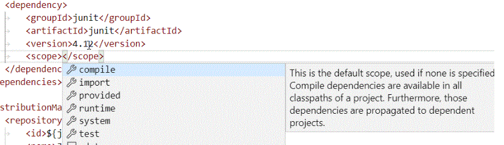

# XML Language Support by Red Hat

[](https://gitter.im/redhat-developer/vscode-xml?utm_source=badge&utm_medium=badge&utm_campaign=pr-badge&utm_content=badge) [](https://marketplace.visualstudio.com/items?itemName=redhat.vscode-xml)

## Description

This VS Code extension provides support for creating and editing XML documents, based on the [LemMinX XML Language Server](https://github.com/eclipse/lemminx), running with Java.


## Features

  * Syntax error reporting
  * General code completion 
  * Auto-close tags
  * Automatic node indentation
  * Symbol highlighting
  * Document folding
  * Document links
  * Document symbols and outline
  * Renaming support
  * Document Formatting
  * DTD validation
  * DTD completion
  * DTD formatting
  * XSD validation
  * XSD based hover
  * XSD based code completion 
  * XSL support
  * XML catalogs
  * File associations
  * Code actions
  * Schema Caching

See the [changelog](CHANGELOG.md) for the latest release. You might also find useful information in the project [Wiki](https://github.com/redhat-developer/vscode-xml/wiki).

## Requirements

  * Java JDK (or JRE) 8 or more recent
  * Ensure Java path is set in either: 
    * `xml.java.home` in VSCode preferences
    * `java.home` in VSCode preferences
    * Environment variable `JAVA_HOME` or `JDK_HOME`  
    * **Note**: The path should end at the parent folder that contains the `bin` folder.  
      **Example Path**: `/usr/lib/jvm/java-1.8.0` if `bin` exists at `/usr/lib/jvm/java-1.8.0/bin`.  
    * **Note**: If the path is not set, the extension will attempt to find the path to the JDK or JRE.

## Supported VS Code settings

The following settings are supported:
  
* `xml.trace.server` : Trace the communication between VS Code and the XML Language Server in the Output view.
* `xml.catalogs` : Register XML catalog files.
* `xml.logs.client` : Enable/disable logging to the Output view.
* `xml.fileAssociations` : Associate XML Schemas to XML file patterns.
* `xml.format.emptyElements` : Expand/collapse empty elements during formatting. Defaults to `ignore`.
* `xml.format.splitAttributes` : Set to `true` to split node attributes onto multiple lines during formatting. Defaults to `false`.
* `xml.format.joinCDATALines` : Set to `true` to join lines in CDATA content during formatting. Defaults to `false`.
* `xml.format.joinContentLines` : Set to `true` to join lines in node content during formatting. Defaults to `false`.
* `xml.format.joinCommentLines` : Set to `true` to join lines in comments during formatting. Defaults to `false`.
* `xml.format.preservedNewLines`: Set the maximum amount of newlines between elements. Defaults to `2`.
* `xml.format.preserveEmptyContent`: Set to `true` to preserve standalone whitespace content in an element. Defaults to `false`.
* `xml.format.spaceBeforeEmptyCloseTag`: Set to `true` to insert space before the end of a self closing tag. Defaults to `true`.
* `xml.format.quotations`: Set to `doubleQuotes` to format and only use `"`, or `singleQuotes` to format and only use `'`. Defaults to `doubleQuotes`.
* `xml.format.enabled` : Enable/disable formatting.
* `xml.autoCloseTags.enabled` : Enable/disable automatic tag closing.  
  **Note** 'editor.autoClosingBrackets' must be turned off to work.  
* `xml.java.home`: Set the Java path required to run the XML Language Server. If not set, falls back  to either the `java.home` preference or the `JAVA_HOME` or `JDK_HOME` environment variables.
* `xml.server.vmargs`: Extra VM arguments used to launch the XML Language Server. Requires VS Code restart.  
* `xml.symbols.enabled`: Enable/disable document symbols (Outline). Default is `true`.
* `xml.validation.enabled`: Set to `false` to disable all validation. Defaults to `true`.
* `xml.validation.schema`: Set to `false` to disable schema validation. Defaults to `true`.
* `xml.validation.noGrammar`: The message severity when a document has no associated grammar. Defaults to `hint`.
* `xml.validation.disallowDocTypeDecl`: Enable/disable if a fatal error is thrown if the incoming document contains a DOCTYPE declaration. Default is `false`.
* `xml.validation.resolveExternalEntities`: Enable/disable resolve of external entities. Default is `false`.
* `xml.server.workDir`: Set an absolute path for all cached schemas to be stored. Defaults to `~/.lemminx`.
* `xml.codeLens.enabled`: Enable/disable XML CodeLens. Default is `false`.
* `xml.symbols.excluded`: Disable document symbols (Outline) for the given file name patterns. Updating file name patterns does not automatically reload the Outline view for the relevant file(s). Each file must either be reopened or changed, in order to trigger an Outline view reload.
        
## Custom XML Extensions

The [LemMinX - XML Language Server](https://github.com/eclipse/lemminx) can be extended to support custom completion, hover, validation, rename, etc by using the [Java Service Provider Interface (SPI)](https://www.baeldung.com/java-spi) mechanism. vscode-xml provides the ability use your custom XML support provider, by adding external jars to the XML language server's classpath.

To do that:

 * create a Java project which provides a custom XML extension providing your custom completion, hover, validation, rename, etc:
    * create the XML extension like [MavenPlugin](https://github.com/angelozerr/lsp4xml-extensions-maven/blob/master/org.eclipse.lsp4xml.extensions.maven/src/main/java/org/eclipse/lsp4xml/extensions/maven/MavenPlugin.java).
    * register your custom completion participant in the XML extension like [MavenCompletionParticipant](https://github.com/angelozerr/lsp4xml-extensions-maven/blob/master/org.eclipse.lsp4xml.extensions.maven/src/main/java/org/eclipse/lsp4xml/extensions/maven/MavenCompletionParticipant.java#L28)
    * register your custom XML extension with [Java Service Provider Interface (SPI)](https://www.baeldung.com/java-spi) mechanism in the [/META-INF/services/org.eclipse.lemminx.services.extensions.IXMLExtension](https://github.com/angelozerr/lsp4xml-extensions-maven/blob/master/org.eclipse.lsp4xml.extensions.maven/src/main/resources/META-INF/services/org.eclipse.lsp4xml.services.extensions.IXMLExtension) file.
    * build a JAR `your-custom-xml-extension.jar`.
 
 * create a `vscode extension` which embeds the `your-custom-xml-extension.jar` JAR and declares this JAR path in the `package.json`:
 
```json
"contributes": {
	"xml.javaExtensions": [
		"./jar/your-custom-xml-extension.jar"
	]
}
```

You can see the [vscode-xml-maven](https://github.com/angelozerr/vscode-xml-maven) sample which registers custom maven completion [MavenCompletionParticipant](https://github.com/angelozerr/lsp4xml-extensions-maven/blob/master/org.eclipse.lsp4xml.extensions.maven/src/main/java/org/eclipse/lsp4xml/extensions/maven/MavenCompletionParticipant.java#L28) for scope:



## Contributing

This is an open source project open to anyone. Contributions are extremely welcome!

For information on getting started, refer to the [CONTRIBUTING instructions](CONTRIBUTING.md).

CI builds can be installed manually by following these instructions:

  1) Download the latest development VSIX archive [from here](http://download.jboss.org/jbosstools/vscode-xml/staging/?C=M;O=D). `(vscode-xml-XXX.vsix)`

  2) Go to the Extensions section in VSCode.

  3) At the top right click the `...` icon.

  4) Select 'Install from VSIX...' and choose the visx file.

Feedback
===============
* File a bug in [GitHub Issues](https://github.com/redhat-developer/vscode-xml/issues),
* Chat with us on [Gitter](https://gitter.im/redhat-developer/vscode-xml),


## License

  EPL 1.0, See [LICENSE](https://github.com/redhat-developer/vscode-xml/blob/master/LICENSE) file.


