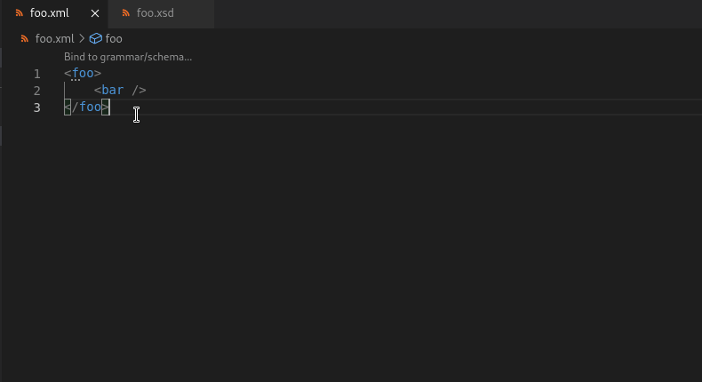
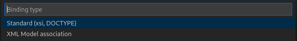
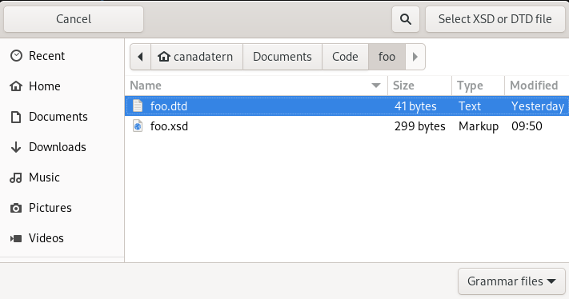
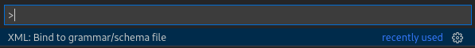
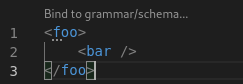
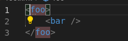
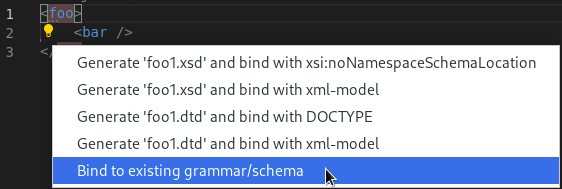
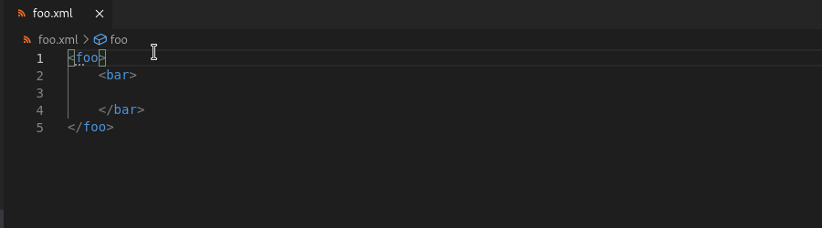
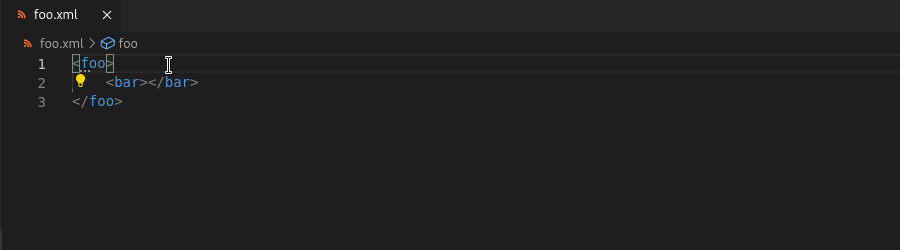
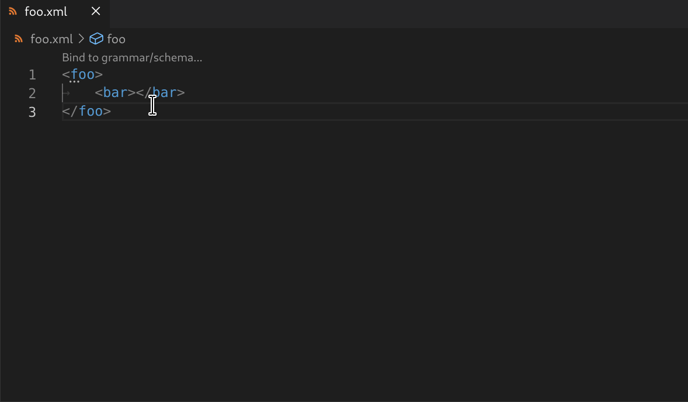

# Binding with Grammar

[vscode-xml](https://github.com/redhat-developer/vscode-xml) provides support for automatic XML schema/grammar binding through generation and/or using an existing `.xsd/.dtd` file.



[Validation with XSD grammar](Validation.md#validation-with-xsd-grammar) and [Validation with DTD grammar](Validation.md#validation-with-dtd-grammar) provide more information on manual binding of an XML document.

In the following sections, we would like to bind the XML document `foo.xml`:
```xml
<foo>
  <bar />
</foo>
```
with an associated grammar file.

## Binding with Existing Grammar

Consider an XSD document, `foo.xsd` (in the same directory as `foo.xml`), defined as follows :
```xsd
<?xml version="1.0" encoding="UTF-8"?>
<xs:schema xmlns:xs="http://www.w3.org/2001/XMLSchema">
  <xs:element name="foo">
    <xs:complexType>
      <xs:sequence>
        <xs:element name="bar" />
      </xs:sequence>
    </xs:complexType>
  </xs:element>
</xs:schema>
```
and a DTD document, `foo.dtd` (in the same directory as `foo.xml`), defined as follows:
```dtd
<!ELEMENT foo (bar)>
<!ELEMENT bar EMPTY>
```

Either file can be bound using the [XML Binding Wizard](#the-xml-binding-wizard), which can be triggered by [Command](#command), [CodeLens](#codelens) or [Quick Fix](#quick-fix).

### The XML Binding Wizard

After opening the binding wizard using one of the methods mentioned above, a dropdown with the following 2 options will appear at the Command Palette:



1. Standard (xsi, DOCTYPE)

If the selected file is an XSD file, this option will bind the grammar file by adding the `xmlns:xsi` (with the value as "http://www.w3.org/2001/XMLSchema-instance") and `xsi:noNamespaceSchemaLocation` (with the value as the path to the grammar file) attributes to the root tag:
```xml
<foo xmlns:xsi="http://www.w3.org/2001/XMLSchema-instance"
 xsi:noNamespaceSchemaLocation="foo.xsd">
    <bar />
</foo>
```

If the XSD file contains a `targetNamespace` attribute, with an `elementFormDefault` attribute with value "qualified" in the `xs:schema` tag, as follows:
```xsd
<xs:schema xmlns:xs="http://www.w3.org/2001/XMLSchema" targetNamespace="http://foo" elementFormDefault="qualified">
```
then the XML document will have the `targetNamespace` set as a `xmlns` attribute and an additional attribute for `xsi:schemaLocation`:
```xml
<foo xmlns="http://foo"
 xmlns:xsi="http://www.w3.org/2001/XMLSchema-instance"
 xsi:schemaLocation="http://foo foo.xsd">
    <bar />
</foo>
```

If the selected file is a DTD file, this option will bind the grammar file by adding a `<!DOCTYPE <root-tag-name> SYSTEM "<grammar-file-path>">` tag at the beginning of the document:
```xml
<!DOCTYPE foo SYSTEM "foo.dtd">
<foo>
    <bar />
</foo>
```

2. XML Model association

This option will bind the grammar file by adding the `xml-model` tag at the beginning of the document, with an `href` value as the path to the grammar file:
```xml
<?xml-model href="foo.xsd"?>
<foo>
    <bar />
</foo>
```
The same applies when selecting `foo.dtd`.

After selecting an option, you can select the desired grammar file using your file explorer:



### Command

The command "XML: Bind to grammar/schema file" can be executed from the VSCode command palette, as well as be bound to a shortcut.



If the current XML document is not bound using an existing grammar/schema, the command will have the user select a existing `.xsd/.dtd` grammar file to bind to the XML document.

Otherwise, an error will be thrown on the client if the XML document already has a bound grammar/schema.

### CodeLens

When [CodeLenses](./Preferences.md#code-lens) are enabled, an unbound XML document will display a CodeLens above the root element as follows:



### Quick Fix

For any unbound XML document, a Quick Fix suggestion will appear beside the root element.



With the cursor on the first opening tag, use `Ctrl + .`, `Quick Fix...` or the lightbulb that appears and select the "Bind to existing grammar/schema"



## Binding with New Grammar

Consider the case where the directory only contains `foo.xml` (i.e. there does not exist an appropriate `.xsd/.dtd` file to bind).

A file can be generated using a [Quick Fix](#quick-fix-1).

### Quick Fix

#### Generate XSD from XML

When an unbound XML file is open, an XML Schema/XSD file can be generated from the opening tag in the XML file.

With the cursor on the first opening tag, use `Ctrl + .` or `Quick Fix...` or the lightbulb that appears and select "Generate foo.xsd and bind with *" to create the file in the the same directory.



#### Generate DTD from XML

When an unbound XML file is open, a Document Type Definition/DTD file can be generated from the opening tag in the XML file.

With the cursor on the first opening tag, use `Ctrl + .` or `Quick Fix...` or the lightbulb that appears and select "Generate foo.dtd and bind with *" to create the file in the the same directory.



#### Generate RELAX NG from XML

When an unbound XML file is open, a RELAX NG schema can be generated from the opening tag in the XML file.

With the cursor on the first opening tag, use `Ctrl + .` or `Quick Fix...` or the lightbulb that appears and select "Generate foo.rng and bind with RelaxNG" to create the file in the the same directory.


