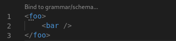
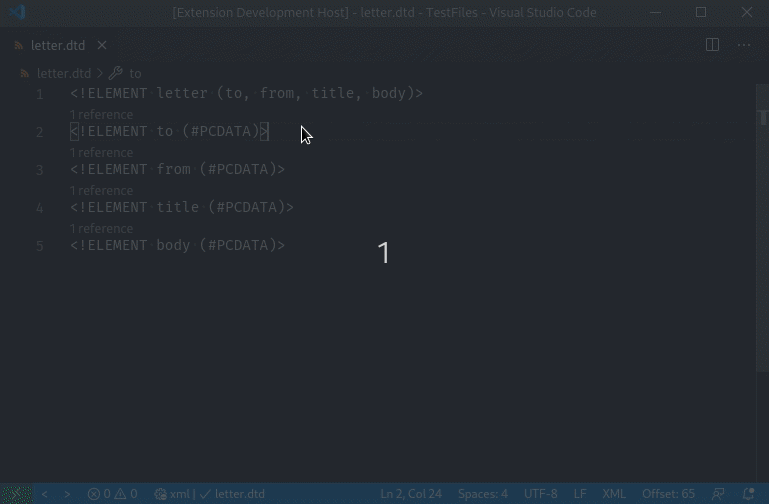
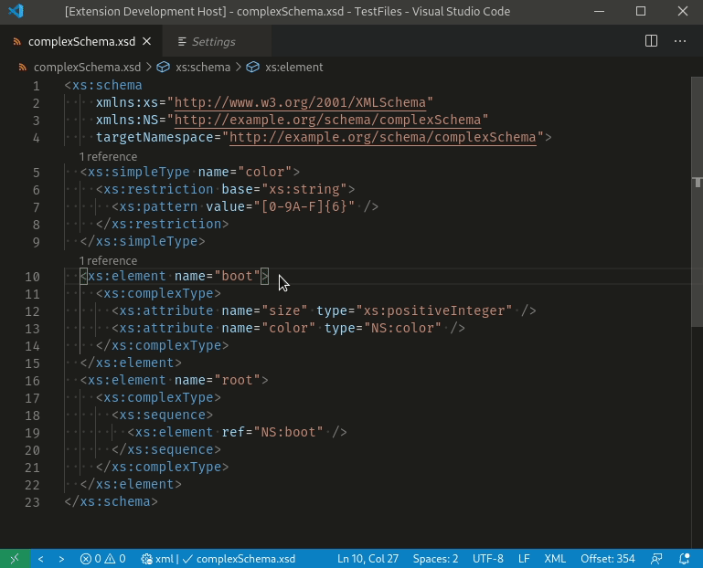

## Code Lens

### XML Features

CodeLens provides grammar binding for unbound XML documents, appearing above the root element, which will trigger the [XML Binding Wizard](BindingWithGrammar.md#the-xml-binding-wizard).



### DTD features

Code lens is provided in `.dtd` files to show where elements defined in the DTD are referenced.
For instance, in the following code:

```xml
<!ELEMENT letter (to, from, title, body)>
<!ELEMENT to (#PCDATA)>
<!ELEMENT from (#PCDATA)>
<!ELEMENT title (#PCDATA)>
<!ELEMENT body (#PCDATA)>
```

There will be a code lens entry after the first line that points from the
definition of the element `to` to where it is used in the definition of the
element `letter`.

Here is a demonstration of the above Code Lens:



### XSD Features

Code lens is also provided in `.xsd` files. It shows where top level types
and elements are referenced. For instance, in the following code:

```xml
<?xml version="1.0" encoding="UTF-8"?>
<xs:schema
    xmlns:xs="http://www.w3.org/2001/XMLSchema"
    targetNamespace="http://example.org/my-example"
    xmlns:NS="http://example.org/my-example">
  <xs:element
      name="root-element"
      type="NS:yell" />
  <xs:simpleType name='yell'>
    <xs:restriction base='xs:string'>
      <xs:pattern value='[A-Z]+!'></xs:pattern>
    </xs:restriction>
  </xs:simpleType>
</xs:schema>
```

There will be a code lens above the line where the `yell` type is defined
that points to where it is referenced when defining the `root-element` element.

Here is a demonstration of the above Code Lens:


Here is a demonstration of the code lens for `xs:element`:


