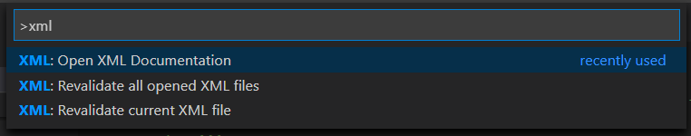

# Commands

[vscode-xml](https://github.com/redhat-developer/vscode-xml) provides several vscode commands which are available with `Ctrl+Shift+P`.

## Bind to grammar/schema file

This command triggers the [XML Binding Wizard](BindingWithGrammar.md#the-xml-binding-wizard) for the current file.

Details on the command are described [here](BindingWithGrammar.md#command).

## Open XML Documentation

This command opens the `XML Documentation`.

## Revalidate current XML file

This command re-triggers the [XML Validation](Validation.md#xml-validation) for the current file.

When the [Server Cache Path](Preferences.md#server-cache-path) is activated, the command removes the referenced XSD, DTD grammar from the local cache.

## Revalidate all open XML files

This command re-triggers the [XML Validation](Validation.md#xml-validation) for the all opened XML files.

When the [Server Cache Path](Preferences.md#server-cache-path) is activated, the command clears the remote grammar cache and revalidates all opened files.

## Restart XML Language Server

This command restarts the XML language server.

## Minify XML Document

This command minifies the current XML document by removing unnecessary whitespace while preserving the document's structure and content.

The minification can be triggered via the **Source > Minify XML** menu.

The minification process:
- Removes all indentation and line breaks between elements
- Removes whitespace between the XML declaration and the root element
- Normalizes whitespace sequences inside text content to a single space
- Preserves whitespace in elements with `xml:space="preserve"` attribute
- Preserves content in CDATA sections
- Reduces multiple spaces between attributes to a single space

This is useful for reducing file size before transmitting or storing XML documents.