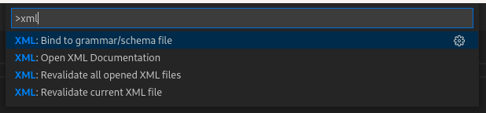

# Commands

[vscode-xml](https://github.com/redhat-developer/vscode-xml) provides several vscode commands which are available with `Ctrl+Shift+P`.

## Bind to grammar/schema file

This command triggers the [XML Binding Wizard](BindingWithGrammar.md#the-xml-binding-wizard) for the current file.

Details on the command are described [here](BindingWithGrammar.md#command).

## Open XML Documentation

This command opens the `XML Documentation`.

## Revalidate current XML file

This command re-triggers the [XML Validation](Validation.md#xml-validation) for the current file.

When the [Server Cache Path](Preferences.md#server-cache-path) is activated, the command removes the referenced XSD, DTD grammar from the local cache.

## Revalidate all open XML files

This command re-triggers the [XML Validation](Validation.md#xml-validation) for the all opened XML files.

When the [Server Cache Path](Preferences.md#server-cache-path) is activated, the command clears the remote grammar cache and revalidates all opened files.

## Restart XML Language Server

This command restarts the XML language server.
