# Extensions

## Contribution in package.json

### Custom language

If your vscode extension defines a custom language `myxml` in package.json:

 ```json
"contributes": {
    "languages": [
        {
            "id": "myxml",
            "extensions": [
                ".myxml"
            ]
        }
    ]
```

and you want that `myxml` language uses [vscode-xml](https://github.com/redhat-developer/vscode-xml) language server, you need to declare it with `xmlLanguageParticipants`: 

 ```json
"contributes": {
  "xmlLanguageParticipants": [
    {
      "languageId": "myxml"
    }
  ]
}
```
   
## Custom XML Extensions (written in Java)

The [LemMinX - XML Language Server](https://github.com/eclipse/lemminx) can be extended to support custom completion, hover, validation, rename, etc by using the [Java Service Provider Interface (SPI)](https://www.baeldung.com/java-spi) mechanism.
vscode-xml provides the ability to use your custom XML support provider, by adding external jars to the XML language server's classpath.

To do that:

 * create a Java project which provides a custom XML extension providing your custom completion, hover, validation, rename, etc:
 * create the XML extension like [MavenLemminxExtension](https://github.com/eclipse/lemminx-maven/blob/master/lemminx-maven/src/main/java/org/eclipse/lemminx/extensions/maven/MavenLemminxExtension.java).
 * register your custom completion participant in the XML extension like [MavenCompletionParticipant](https://github.com/eclipse/lemminx-maven/blob/master/lemminx-maven/src/main/java/org/eclipse/lemminx/extensions/maven/MavenCompletionParticipant.java#L75)
 * register your custom XML extension with [Java Service Provider Interface (SPI)](https://www.baeldung.com/java-spi) mechanism in the [/META-INF/services/org.eclipse.lemminx.services.extensions.IXMLExtension](https://github.com/eclipse/lemminx-maven/blob/master/lemminx-maven/src/main/resources/META-INF/services/org.eclipse.lemminx.services.extensions.IXMLExtension) file.
 * build a JAR `your-custom-xml-extension.jar`.
 * refer to [Running your Java LemMinX extension](#Running-your-Java-LemMinX-extension) for instructions on setting up the Java LemMinX extension to run in VS Code

You can see the [vscode-xml-maven](https://github.com/angelozerr/vscode-xml-maven) sample which registers custom maven completion [MavenCompletionParticipant](https://github.com/eclipse/lemminx-maven/blob/master/lemminx-maven/src/main/java/org/eclipse/lemminx/extensions/maven/MavenCompletionParticipant.java#L210) for scope:

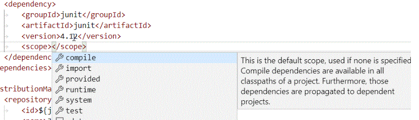

### Running your Java LemMinX extension

In order to run your Java LemMinX extension, you need to compile it and register it with the vscode-xml VS Code extension.

The first step in this process is compiling your Java LemMinX extension into the `.jar` format.
You can use either an Uber `.jar` (one `.jar` with all the dependencies bundled) or a group of `.jar`s (one `.jar` for your extension and one `.jar` for each dependency).
Once you have your `.jar`(s), you must register them with vscode-xml in one of two ways:

1. **Register with a new VS Code TypeScript/JavaScript extension**:

   Make a new VS Code TypeScript/JavaScript extension using the instructions in the [VS Code extension development documentation](https://code.visualstudio.com/api/get-started/your-first-extension).
   Embed the `.jar`(s) into the VS Code TypeScript/JavaScript extension by copying them into the same folder as the `package.json`, or a child folder.
   In the `package.json`, add the `"xml.javaExtensions"` section under the `"contributes"` section, and list the paths to all of the `.jar`s of your Java LemMinX extension.
   You can also use glob patterns to simplify this:

   ```json
   "contributes": {
     "xml.javaExtensions": [
       "./jar/dependencies/*.jar",
       "./jar/my-xml-extension.jar"
     ]
   }
   ```

   Your extension project should look something like this:

   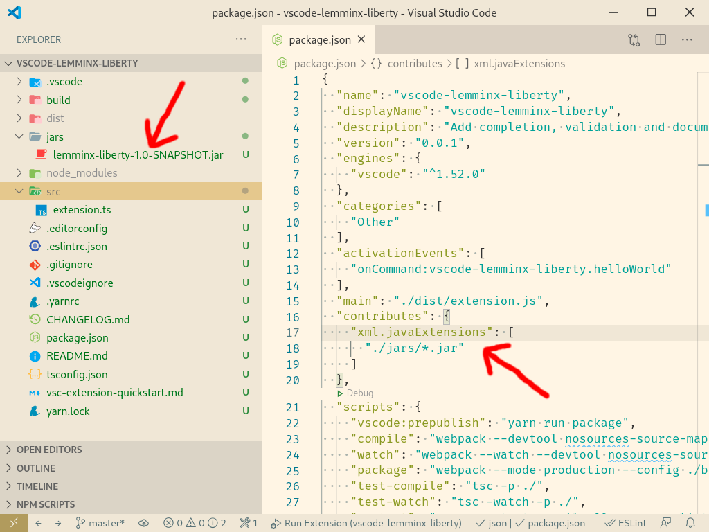

   Open the debug sidebar (Ctrl+Shift+D), and select "Run extension":

   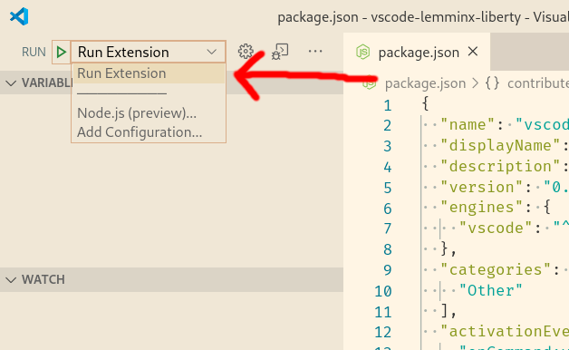

   This will run your VS Code TypeScript/JavaScript extension in a new instance of VS Code.
   Your Java LemMinX extension will be running in this instance of VS Code.
   Every time you make changes to your Java LemMinX extension, you will need to compile it into `.jar`s, copy the `.jar`s over to your VS Code TypeScript/JavaScript extension folder, and restart the debug version of VS Code.

2. **Register the `.jar`(s) using the `"xml.extension.jars"` setting:**

   This method is intended only for development and debugging purposes, and should not be used to distribute your Java LemMinX extension.
   Add the following entry to your VS Code `settings.json`:

   ```json
   "xml.extension.jars": [
     "/absolute/path/to/your/JavaLemMinXExtension.jar"
   ],
   ```

   Make sure to list all the `.jar`s that are needed to run your extension.
   All the paths must be absolute paths (see [#383](https://github.com/redhat-developer/vscode-xml/issues/383)).
   You can use glob patterns to specify groups of `.jar`s.
   If you add, remove, or modify an entry in this list, the change won't take affect in the current VS Code window until you close and reopen that VS Code window.
   In order for changes to your Java LemMinX extension to be reflected in VS Code, you must recompile the `.jar`(s), then close and reopen the VS Code window.

### Debugging your Java LemMinX extension

In order to debug your Java LemMinX extension, your Java LemMinX extension needs to be running.
Please make sure to read [Running your Java LemMinX extension](#Running-your-Java-LemMinX-extension) first.
If you are running your Java LemMinX extension by using a new VS Code TypeScript/JavaScript extension, you will have to package your VS Code TypeScript/JavaScript extension as a `.vsix` and install the packaged extension:

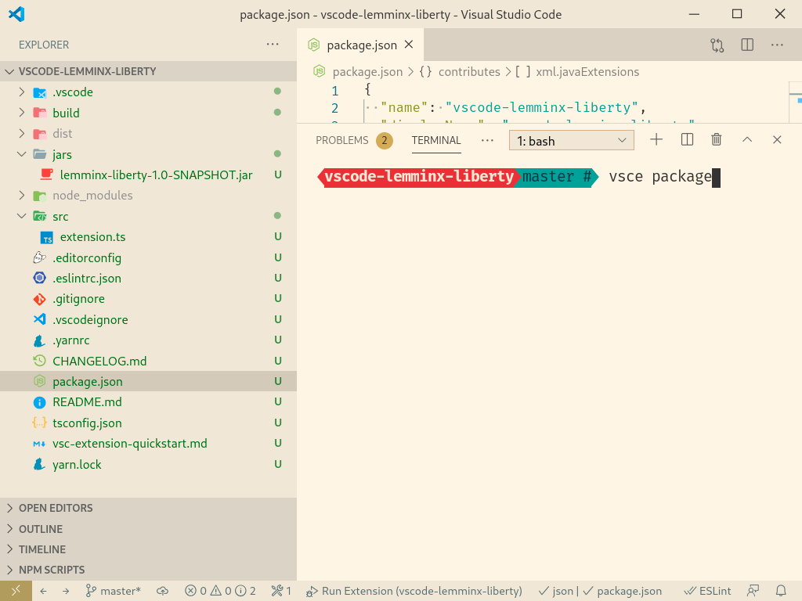

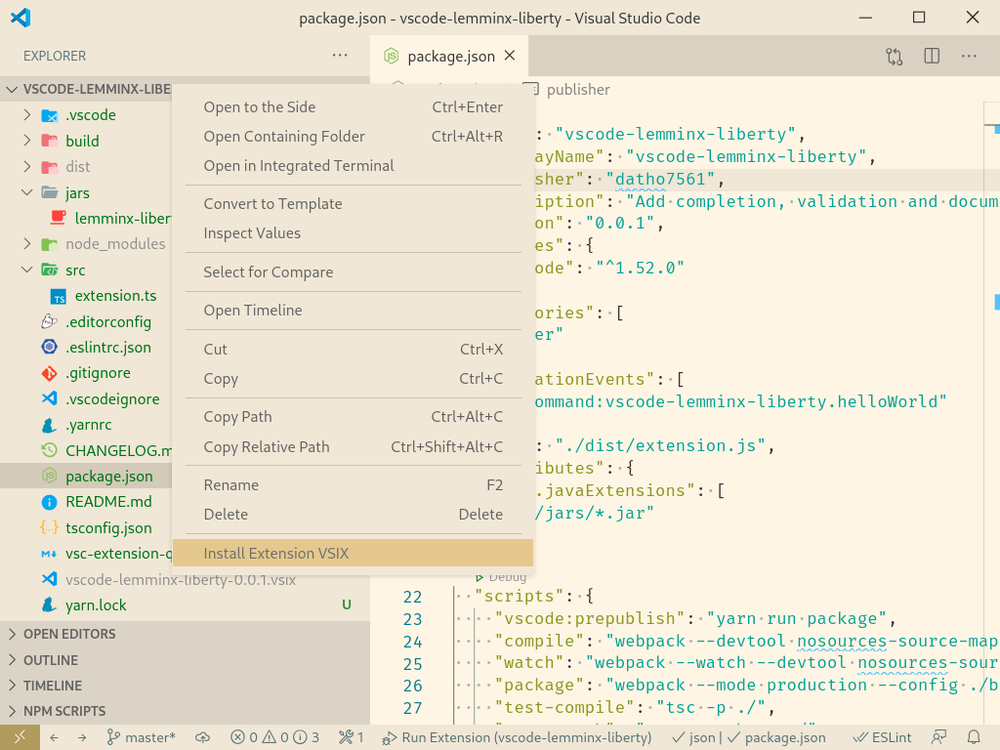

You can also install it in a terminal.

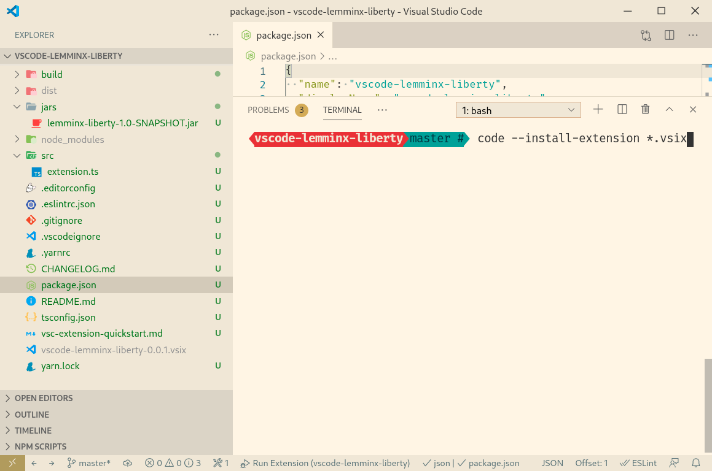

You also need to have a development environment for vscode-xml and LemMinX setup.
Please follow the instructions in [Contributing.md](https://github.com/redhat-developer/vscode-xml/blob/main/CONTRIBUTING.md#development) in order to set this up.

You can debug your Java LemMinX extension in any Java IDE that supports remote debugging. Here are the debugging instructions for both VS Code (with vscode-java) and Eclipse.

#### VS Code

1. Create a file `.vscode/launch.json` in your Java LemMinX extension project folder.
   The folder structure should look something like this:

   ```
   | v .vscode
   | | - launch.json
   | v src
   | | > main
   | | > test
   | > target
   | - pom.xml
   | - mvnw
   |   ...
   ```

2. In `launch.json`, add the following, Change the value of `projectName` to the name of your extension:
   ```json
   {
     "version": "0.2.0",
     "configurations": [{
       "type": "java",
       "name": "Remote Debug Java LemMinX extension",
       "request": "attach",
       "hostName": "localhost",
       "port": 1054,
       "projectName": "your.lemminx.extension.name"
     }]
   }
   ```
3. Make a VS Code multi-root workspace with two folders open:
    * The vscode-xml VS Code extension project folder. i.e. open the folder that contains the `package.json`.
    * Your Java LemMinX extension project folder. i.e. open the folder that contains the `pom.xml`.

   It should look like this:

   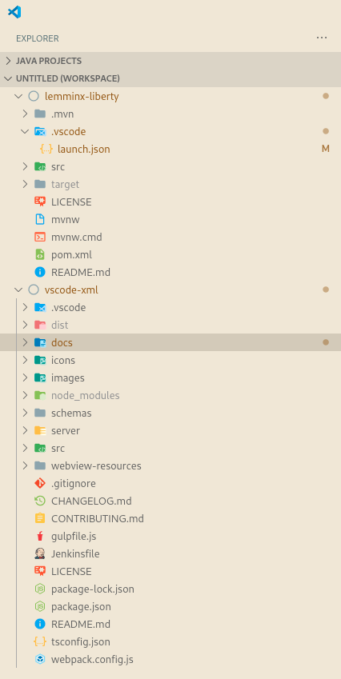

4. Compile LemMinX by running `npm run build-server` in the vscode-xml project folder.

5. Launch the vscode-xml VS Code extension in debug mode by opening the debug view (Ctrl+Shift+D), then selecting "Launch Extension (vscode-xml)".

   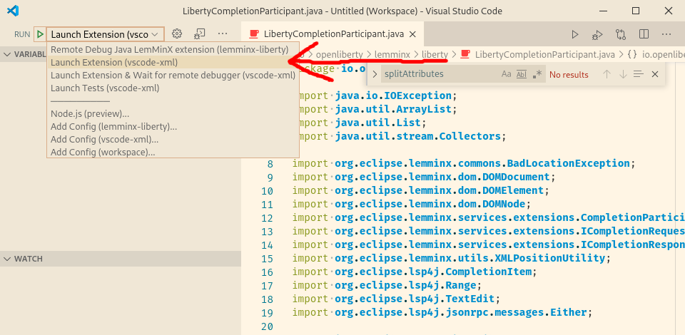

   It will open a new window with vscode-xml running in debug mode.

   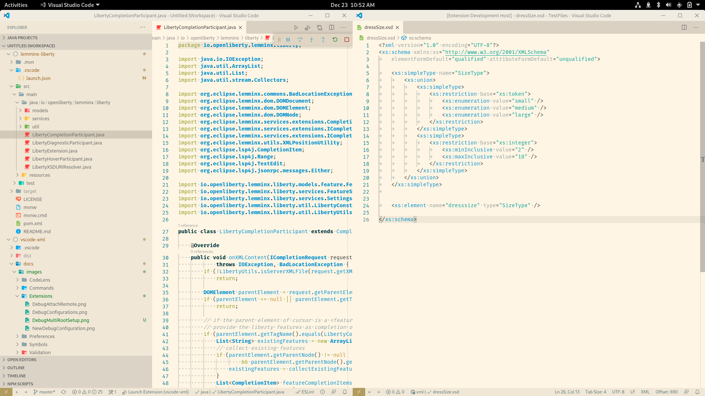

6. Open an XML file in the debug version of VS Code. Double check that vscode-xml is running by trying completion (Ctrl+Enter).

7. In the VS Code window where your Java LemMinX extension project is open, reopen the debug view (Ctrl+Shift+D), then select "Remote Debug Java LemMinX extension" to start debugging:

   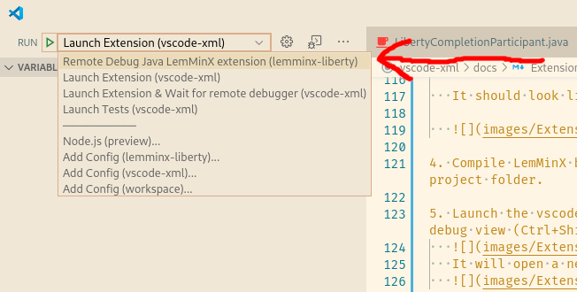

   If you get a connection refused error, it could mean that LemMinX is not running.
   Make sure you are running vscode-xml and that you have opened an XML file.
   It could also mean that a debug session has already been started.

8. Debug
   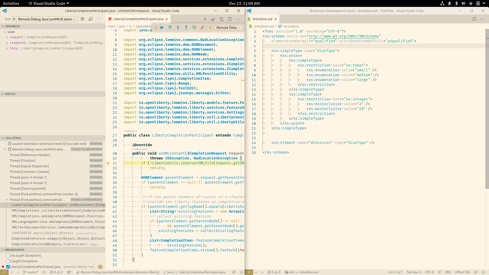

#### Eclipse

1. Open vscode-xml in VS Code. Compile LemMinX by running `npm run build-server` in the vscode-xml project folder.

2. Launch the vscode-xml VS Code extension in debug mode by opening the debug view (Ctrl+Shift+D), then selecting "Launch Extension":

   

   It will open a new window with vscode-xml running in debug mode:

   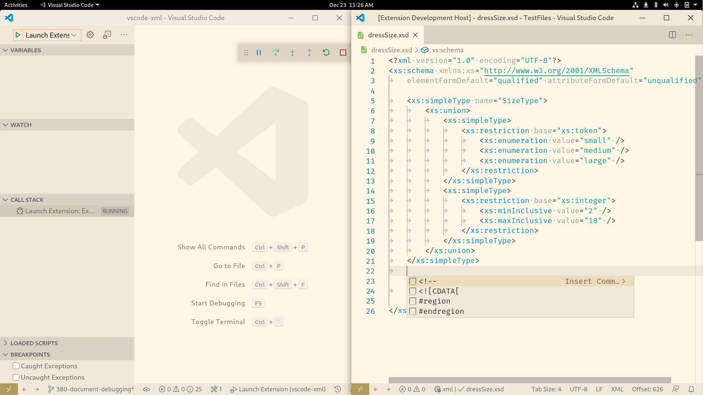

3. Open an XML file in the debug version of VS Code. Double check that vscode-xml is running by trying completion (Ctrl+Enter).

4. Open your Java LemMinX extension project in Eclipse

   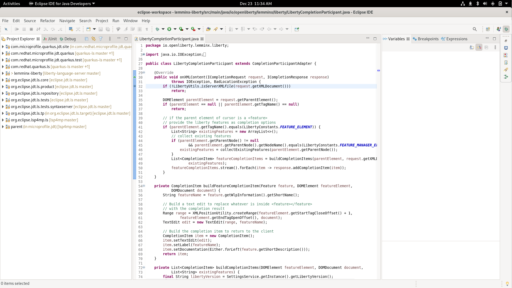

5. Select "Run > Debug configurations":

   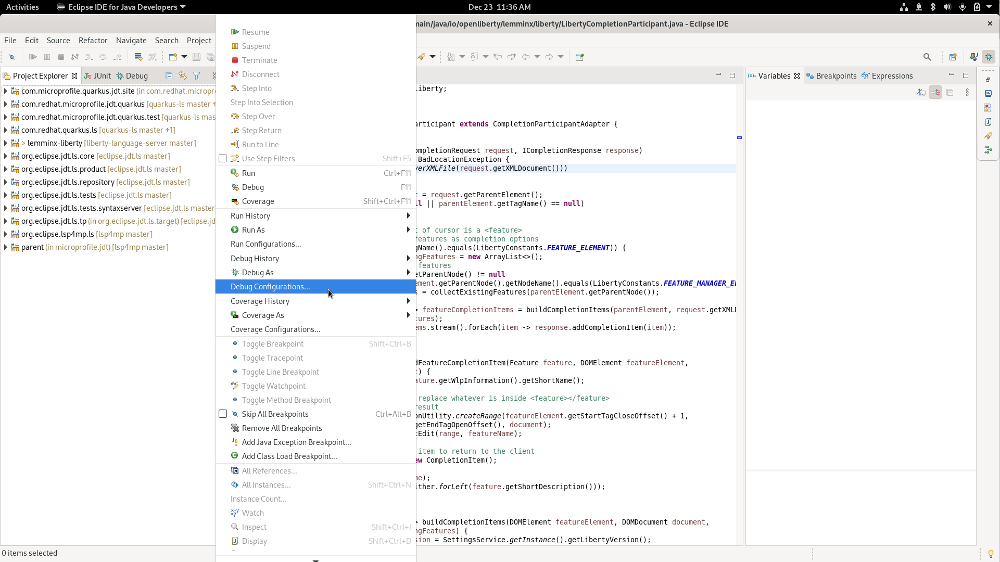

   It will open a window that looks like this:

   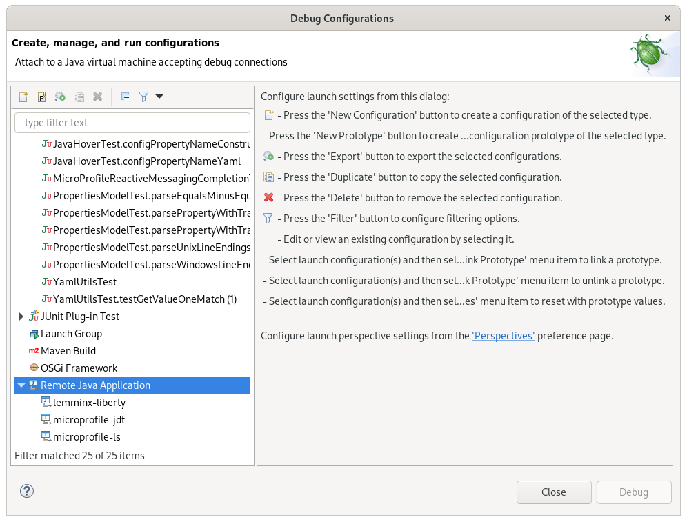

6. Right click "Remote Java Application" and select "Add a new entry". Give the entry an appropriate name.
   For the project field, select your Java LemMinX extension project.
   Enter "localhost" as the Host, and for the port, enter "1054".
   Click "Apply" to save the configuration.

   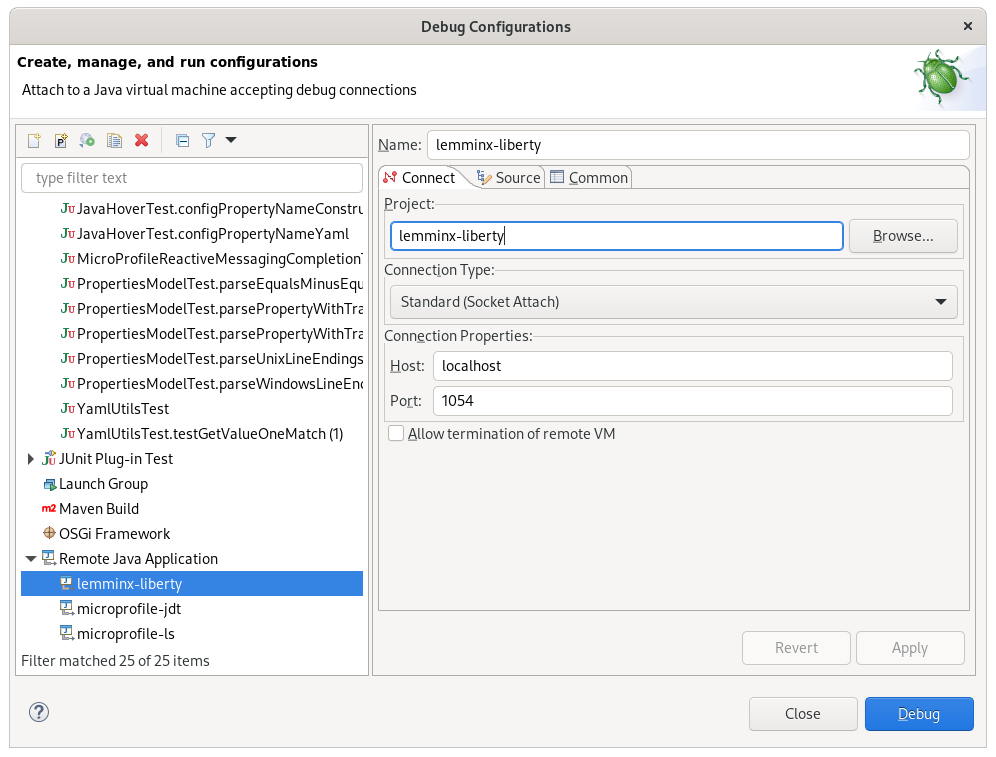


7. In Eclipse, reopen "Run > Debug configurations". Select the configuration you make in step 6, then click "Debug".
    * If you get a connection refused error, it could mean that LemMinX is not running.
      Make sure you are running vscode-xml and that you have opened an XML file.
      It could also mean that a debugging session is already running.

8. Debug

   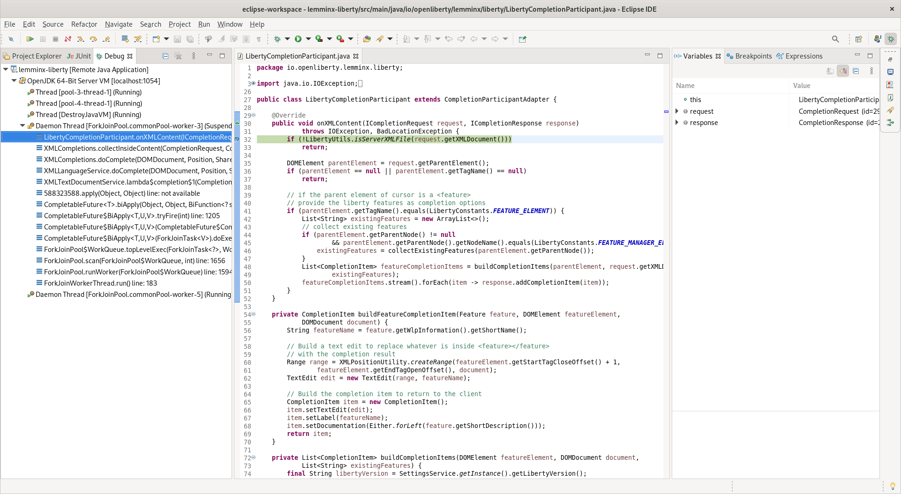
## Binary Server

Unfortunately, classes cannot be loaded dynamically through SPI in the binary version of the LemMinX language server.
This means that you can't use LemMinX extensions with the binary server.
vscode-xml will always launch the Java version of the server if LemMinX extensions are detected and Java is present.
If you launch vscode-xml in binary mode with LemMinX extensions installed, a warning will be displayed that extensions are found but can't be used without Java.

## XML extension API (TypeScript)

See [PR 292](https://github.com/redhat-developer/vscode-xml/pull/292)

### Commands

`xml.workspace.executeCommand` - command registered on VSCode client (via **vscode-xml** extension) to let other extensions execute commands on XML Language server

`xml/executeClientCommand` - XML Language server LSP extension to let XML LS extenders execute commands on the client. The command is made available via `IXMLCommandService` on the server side. See [XML LS extensions docs](https://github.com/eclipse/lemminx/blob/main/docs/LemMinX-Extensions.md#xml-language-server-services-available-for-extensions)
