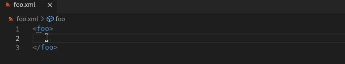
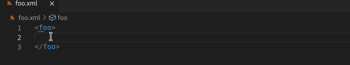
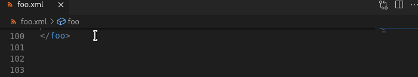
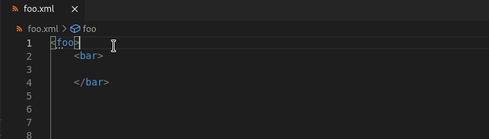
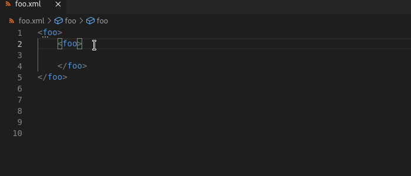

# Features

## XML Tag Auto Close

[vscode-xml](https://github.com/redhat-developer/vscode-xml) provides an `auto close` feature for XML tags:

Using `/` in an opening tag will auto close the tag.

Using a `>` at the end of an opening tag generates the corresponding closing tag.

## Jump to Start/End Tag

For quick navigation, you can use `Ctrl + Click` on a closing tag to jump to the corresponding opening tag.

The same applies to jumping from an opening tag to the respective closing tag.

## Rename Tag

To rename a single tag and it's corresponding opening/closing, highlight the tag and press `F2` or use the dropdown to select `Rename Symbol`.

## Selection Range

You can use `Alt + Shift + Right Arrow` to expand your selection range according to the structure of the XML document.

For instance, if you expand the selection range in an element with text content, it will first select all the text content, then the element.

This also works for other portions of an XML document, such as attributes and the DTD subset.

