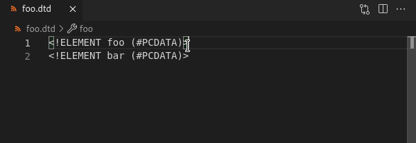
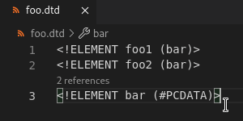
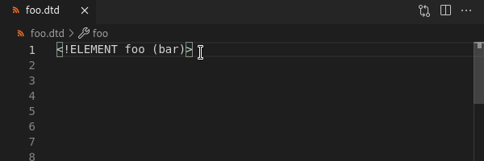
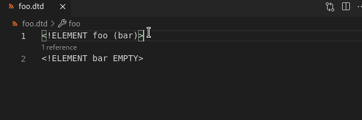

# DTD Features

## CodeLens Support

CodeLens is supported for `.dtd` files, which can show where an element declaration is referenced.

This feature also supports listing and highlighting the number of references to an element declaration and the line(s) referenced on.

### Read more

See [CodeLens](../CodeLens.md#code-lens) for more details.

## Category Accessibility

After defining an `!ELEMENT` tag in the `.dtd` file, there are features available for categories.

### Jump to element declaration

For an `!ELEMENT` tag that contains a category/element-content attribute, there is support for navigating to its definition element.

## Syntax Validation

DTD syntax validation is enabled for any `.dtd` file.

