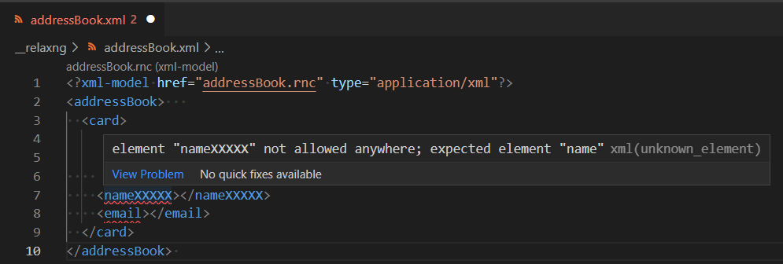
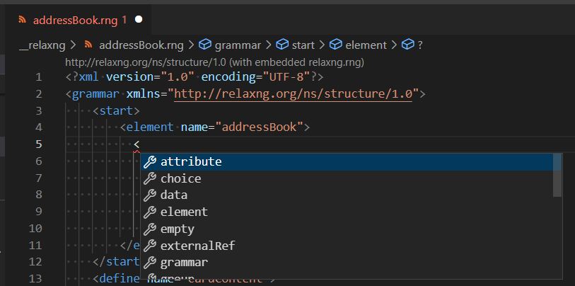
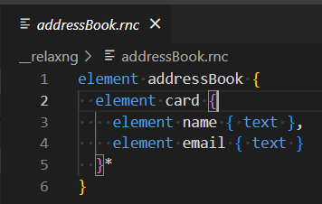
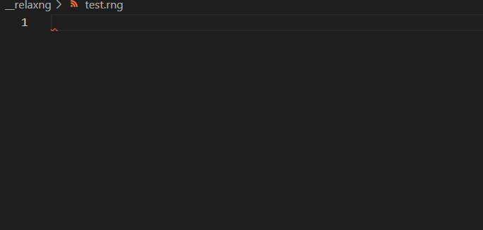
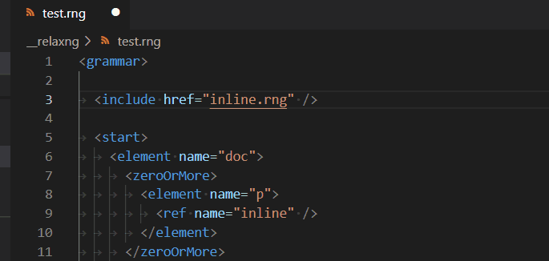
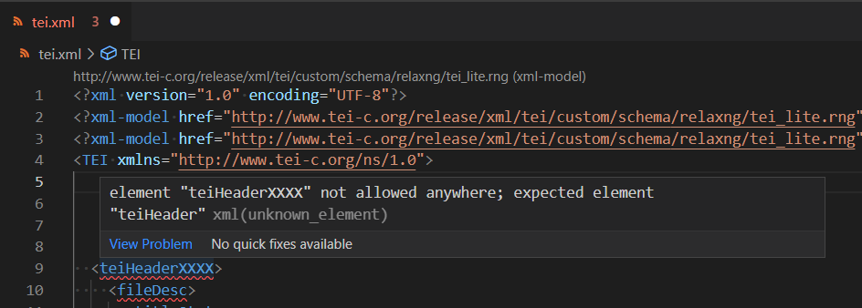
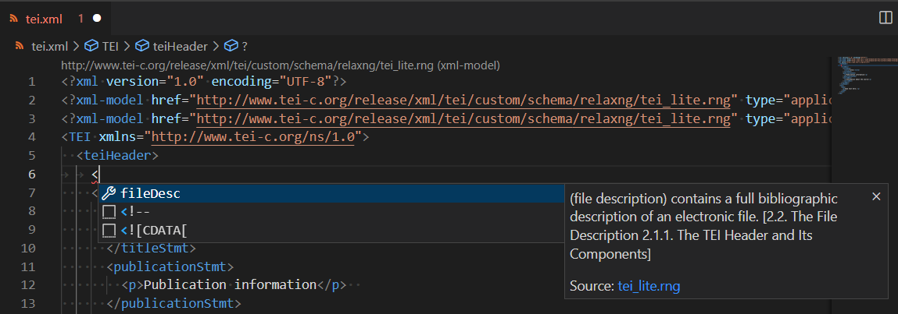
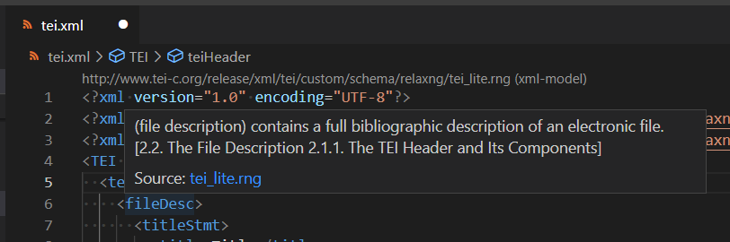
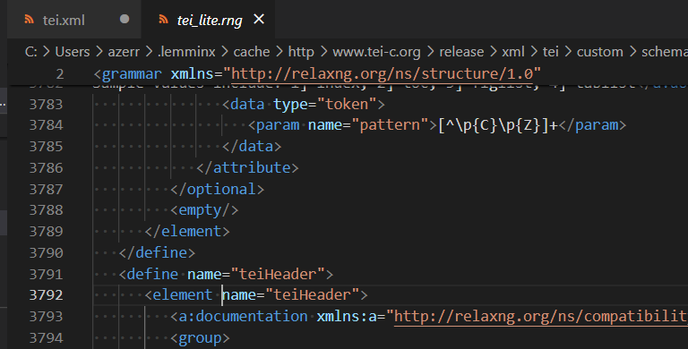
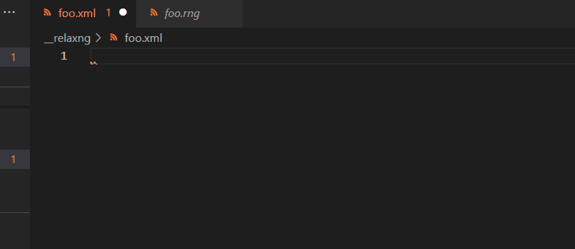

# RelaxNG features

[vscode-xml](https://github.com/redhat-developer/vscode-xml) provides validation, completion, hover in XML file based on [RelaxNG schemas](https://relaxng.org/) since `0.22.0`:


It supports both:

 * [RelaxNG XML syntax (*.rng files)](https://relaxng.org/tutorial-20011203.html).
 * [RelaxNG Compact syntax (*.rnc files)](https://relaxng.org/compact-tutorial-20030326.html).



You can associate your XML file with `RelaxNG grammar` (`file` or `URL`) using :

 * an `xml-model` processing instruction

```xml
<?xml-model href="addressBook.rng" type="application/xml"?>
<addressBook>   
  ...
</addressBook> 
```

 * an `XML catalog` using the same method as [XSD](Validation.md#XML-catalog-with-XSD)
 * a `file association` using the same method as [XSD](Validation.md#XML-file-association-with-xsd)

## RelaxNG grammar

[vscode-xml](https://github.com/redhat-developer/vscode-xml) provides support for `RelaxNG grammars`:

 * for [RelaxNG XML syntax (*.rng files)](https://relaxng.org/tutorial-20011203.html), it provides the same support as XSD/DTD grammars (completion, hover, validation, etc).
 


 * for [RelaxNG Compact syntax (*.rnc files)](https://relaxng.org/compact-tutorial-20030326.html) it provides only syntax coloration.
 


### RelaxNG grammar XML Syntax

[vscode-xml](https://github.com/redhat-developer/vscode-xml) provides support for reference between `define/@name` and `ref/@name` with codelens, definition, completion, highlighting, references, rename:



It also provides support for `include/@href` and `externalRef/@href` attributes to navigate easily to the referenced `rng` grammar file:



# Validation

XML validation based on RelaxNG (rng, rnc) is supported:



# Completion

XML completion based on RelaxNG (rng, rnc) is supported. The completion for rng can show the documentation:



# Hover

Hover based on RelaxNG rng can show the documentation:



# Go to Type Definition

From the XML document you can go to the type definition to navigate to the element/attribute declaration for both `rnc` and `rng`.

To do this, select an XML element/attribute and use the contextual menu `Go to Type Definition`: 


When you click on this menu item, VS Code will open the `rng` or `rnc` grammar file and place the cursor on the proper `element/attribute` declaration:



# How to start?

## Using snippets

You can use snippets to quickly create:

 * an XML file associated with a RelaxNG grammar
 * a RelaxNG XML file
 
Here's a demo:



## Creating XML, rng, rnc files

You can create a RelaxNG grammar that uses the XML syntax by making a file with the extension `.rng`. 
For instance, here is a file `addressBook.rng` that defines a RelaxNG grammar:

```xml
<?xml version="1.0" encoding="UTF-8"?>
<grammar xmlns="http://relaxng.org/ns/structure/1.0">
    <start>
        <element name="addressBook">
            <zeroOrMore>
                <element name="card">
                    <ref name="cardContent"/>
                </element>
            </zeroOrMore>
        </element>
    </start>
    <define name="cardContent">
        <element name="name">
            <text/>
        </element>
        <element name="email">
            <text/>
        </element>
    </define>
</grammar>
```

You can create a RelaxNG grammar that uses the [compact syntax](https://relaxng.org/compact-tutorial-20030326.html) by making a file with the extension `.rnc`. 
For instance, here is a file `addressBook.rnc` that defines the same RelaxNG grammar as `addressBook.rng`:

```rnc
element addressBook {
  element card {
    element name { text },
    element email { text }
  }*
} 
```

The following file, `addressBook.xml`, references `addressBook.rng` using the `xml-model` processing instruction. 
[vscode-xml](https://github.com/redhat-developer/vscode-xml) will provide the features based on the grammar shown in [the demo at the beginning of this page](#relaxng-features) when you open `addressBook.xml`.

```xml
<?xml-model href="addressBook.rng" type="application/xml"?>
<addressBook>   
  <card>
    <name></name>
    <email></email>
  </card>
</addressBook> 
```

# Generate RELAX NG from XML

When an unbound XML file is open, a RELAX NG schema can be generated from the opening tag in the XML file.

See: [Generate RELAX NG from XML](../BindingWithGrammar.md#generate-relax-ng-from-xml).
