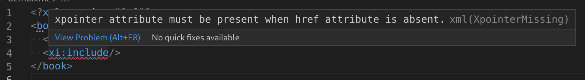

# XInclude Features

## Validation

XML validation with [XInclude](https://www.w3.org/TR/xinclude/) is supported, which can be enabled / disabled with the `xml.validation.xInclude.enabled` setting.

