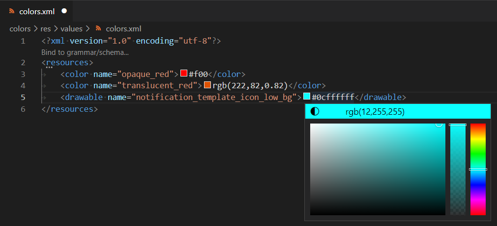

# XML Colors Features

XML colors support provides the capability to mark a DOM node (attribute or text) as color with the `xml.colors` settings by using XPath expression : 

 * `color/text()` defines the text node of the `color` element.
 * `item/@color` defines the `color` attribute node of the `item` element.

## Define Color in Text Content with `color/text()`

Given this [android color](https://developer.android.com/guide/topics/resources/more-resources#Color) XML file sample:

```xml
<?xml version="1.0" encoding="utf-8"?>
<resources>
	<color name="opaque_red">#f00</color>
	<color name="translucent_red">rgb(222,82,0.82)</color>
	<drawable name="notification_template_icon_low_bg">#0cffffff</drawable>
</resources>
```

In this sample, text of `color` tag element `<color name="opaque_red">#f00</color>` declare a color with hexadecimal. [vscode-xml](https://github.com/redhat-developer/vscode-xml) provides a color support with the `xml.colors` settings. For [android color](https://developer.android.com/guide/topics/resources/more-resources#Color) case, you can declare this settings:

```json
"xml.colors": [
   {
      "pattern": "**/res/values/colors.xml",
      "expressions": [
         {
            "xpath": "resources/color/text()"
         },
         {
            "xpath": "resources/drawable/text()"
         }
      ]
   }
]
```

After saving this setting, you will get color support for the text node of `color` tag element in the `colors.xml` file:



## Define Color in Attribute with `item/@color`

Attribute values may also be marked as color by using the proper XPath.

Given this `colors.xml` XML file:

```xml
<?xml version="1.0" encoding="utf-8"?>
<resources>
	<item color="#f00" />
	<item color="rgb(222,82,0.82)" />
</resources>
```

You can declare this settings:

```json
"xml.colors": [
   {
      "pattern": "**/colors.xml",
      "expressions": [
         {
            "xpath": "item/@color"
         }
      ]
   }
]
```