# XML Features

[vscode-xml](https://github.com/redhat-developer/vscode-xml) provides a number of notable features, with demos below.

## XML Tag Auto Close

XML tag `auto-close` is supported:

Using `/` in an opening tag will auto close the tag.

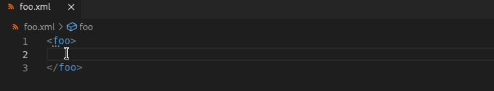

## Auto Rename Tag

Linked editing is supported, allowing for simultaneous changes an opening and closing tag pair.

To enable this feature, the setting `editor.linkedEditing` must be set to `true` in the `settings.json.

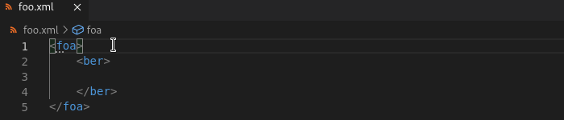

## Jump to Start/End Tag

For quick navigation, you can use `Ctrl + Click` on a closing tag to jump to the corresponding opening tag.

The same applies to jumping from an opening tag to the respective closing tag.

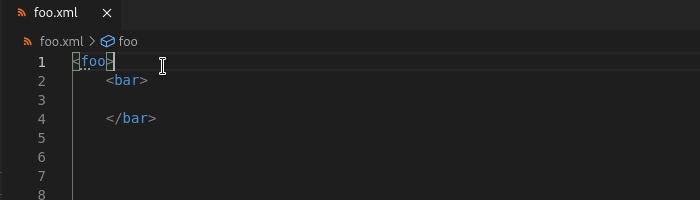

## Rename Tag

To rename a single tag and its corresponding opening/closing, highlight the tag and press `F2` or use the dropdown to select `Rename Symbol`.

## Tag Name Highlighting

When placing the cursor on a XML tag, the corresponding opening/closing tag will be highlighted.

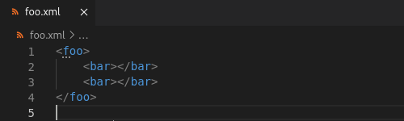

## Symbols from Outline and Breadcrumbs

The `OUTLINE` dropdown under `EXPLORER` details the XML tags in the document and their children. The `Breadcrumbs` bar also shows the hierarchy of the tag that the cursor is on. Both features permit jumping to the tag(s) displayed.

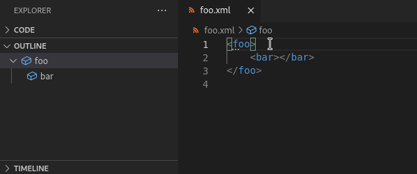

## Snippet Generation

When starting a new XML document, `Ctrl` + `Space` lists different snippet options to set up the document.

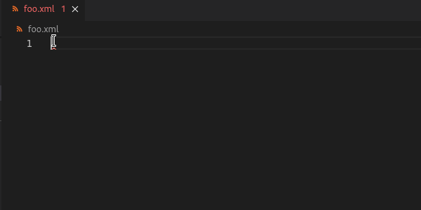

There are also a number of keywords that will be recognized as snippets and autocompleted. For example, typing `schema` will list schema related snippet options.

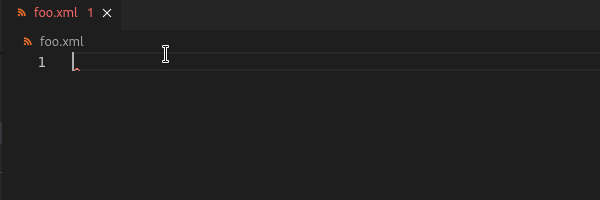

## Completion Support

### Basic completion

If an XML file is not associated to a bound grammar file, you can utilize XML completion which uses existing XML tag elements.

### Attribute value completion

For a XML tag attribute, there is autocompletion support for the attribute value. For example, for path completion, type `.` or `/`.

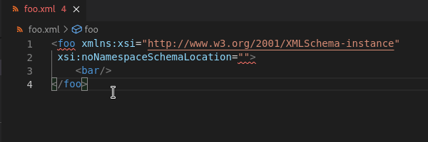

### Completion based on grammar

#### Completion based on XSD

When a XML file is associated with a XSD file, there is support for completion based on the tags, attribute names and values defined in the XML Schema/XSD file.

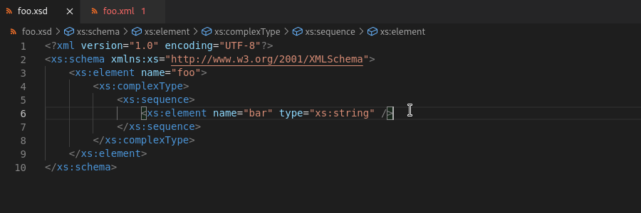

#### Completion based on DTD

When XML file is associated with a DTD file, completion based on tags, attributes name and value defined in the DTD file are supported.

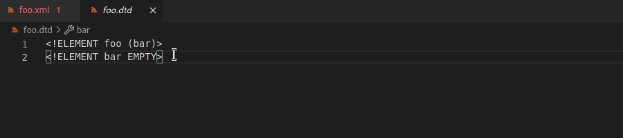

## Jump to Grammar Definition

If an XML file is associated with an XSD file, there is support for jumping from the XML tag to the schema definition.

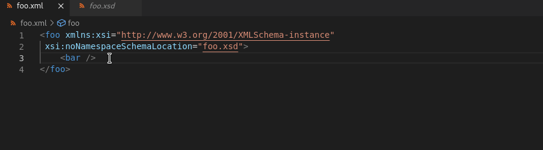

## Hover Support

### Hover based on grammar

#### Hover based on XSD

When XML file is associated with a XSD file, hover documentation based on tags, attributes name and value defined in the XML Schema/XSD file are supported.

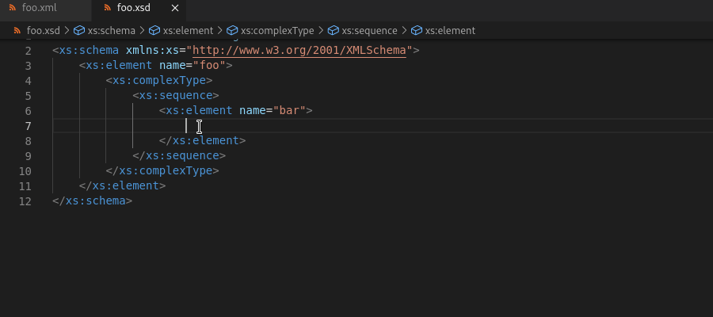

#### Hover based on DTD

When XML file is associated with a DTD file, hover documentation based on tags, attributes name and value defined in the DTD  file are supported.

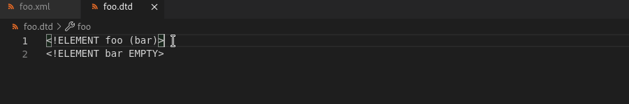

## Validation Support

### Syntax validation

LemMinX will show syntax errors in your XML documentation, and will provide quick fixes to resolve these errors.

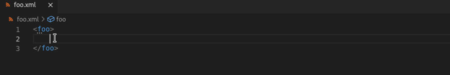

There is also validation based on grammar when a XSD or DTD file is associated with the XML document.

### Read more

See [XML Validation](../Validation.md#xml-validation) for more details.

## Generate Grammar from XML

### Generate XSD from XML

Using an XML file, an XML Schema/XSD file can be generated from the opening tag in the XML file. With the cursor on the first opening tag, use `Ctrl + .` or `Quick Fix...` and select `Generate foo.xsd and bind with *` to create the file in the the same directory.

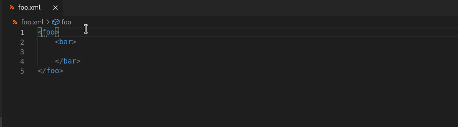

#### Read more

See [Validation with XSD Grammar](../Validation.md#validation-with-xsd-grammar) for more.

### Generate DTD from XML

Using an XML file, a Document Type Definition/DTD file can be generated from the opening tag in the XML file. With the cursor on the first opening tag, use `Ctrl + .` or `Quick Fix...` and select `Generate foo.dtd and bind with *` to create the file in the the same directory.

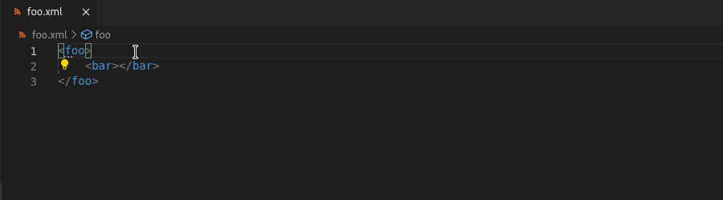

#### Read more

See [Validation with DTD Grammar](../Validation.md#validation-with-dtd-grammar) for more.

## Selection Range

You can use `Alt + Shift + Right Arrow` to expand your selection range according to the structure of the XML document.

For instance, if you expand the selection range in an element with text content, it will first select all the text content, then the element.

This also works for other portions of an XML document, such as attributes and the DTD subset.

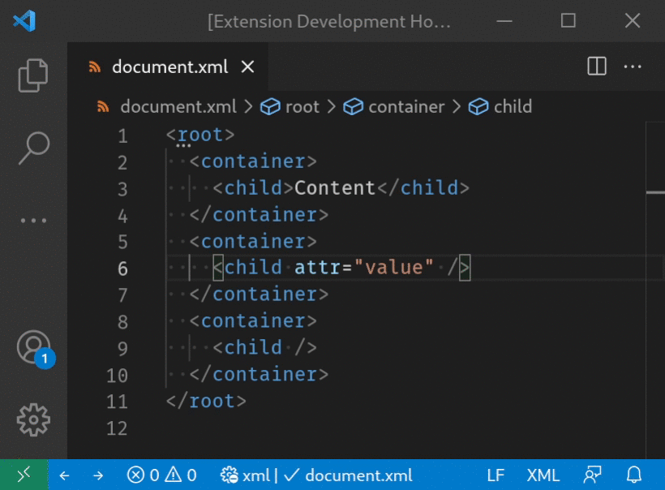

## Custom Feature Implementation

You can implement your own feature with a [Java extension](../Extensions.md).
