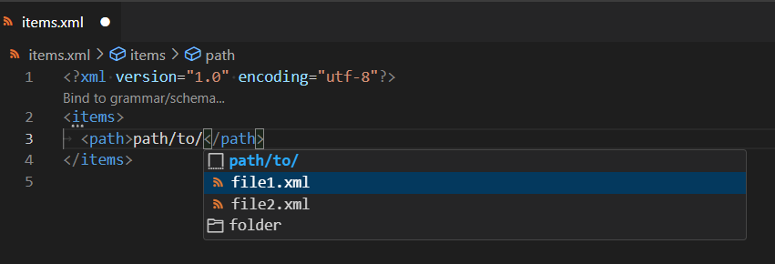
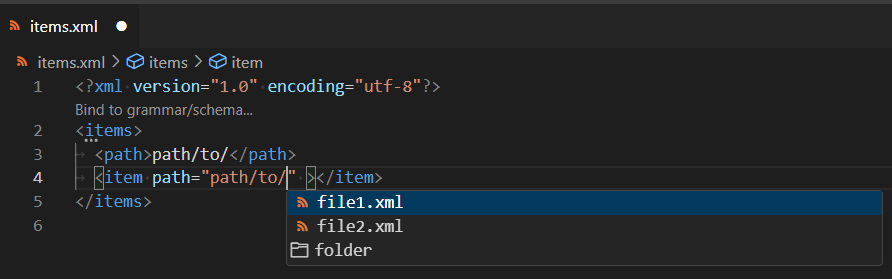

# XML File Paths Features

XML file path support provides the capability to mark a DOM node (attribute or text) as file path with the `xml.filePathSupport.mappings` setting, by using XPath expression :

 * `path/text()` defines the text node of the `path` element.
 * `item/@path` defines the `path` attribute node of the `item` element.

Once the DOM node is designated as a file path, you will enjoy the benefits of file completion.

 * Files completion.

## Define File path in Text Content with `path/text()`

Given this XML file `items.xml` sample:

```xml
<?xml version="1.0" encoding="utf-8"?>
<items>
	<path>path/to/file.xml</path>
</items>
```

In this example:

The text within the `path` tag element `<path>path/to/file.xml</path>` represents a file path. The [vscode-xml](https://github.com/redhat-developer/vscode-xml) extension offers file path support through the `xml.filePathSupport.mappings` settings. You can configure this setting as follows:

```json
"xml.filePathSupport.mappings": [
   {
      "pattern": "**/items.xml",
      "expressions": [
         {
            "xpath": "items/path/text()"
         }
      ]
   }
]
```

After saving this setting, you will get file path completion support for the text node of `path` tag element:



## Define File path in Attribute with `item/@path`

Attribute values may also be marked as file path by using the proper XPath.

Given this `items.xml` XML file:

```xml
<?xml version="1.0" encoding="utf-8"?>
<items>
	<item path="path/to/file.xml" ></item>
</items>

```

You can declare this settings:

```json
"xml.filePathSupport.mappings": [
   {
      "pattern": "**/items.xml",
      "expressions": [
         {
            "xpath": "item/@path"
         }
      ]
   }
]
```

After saving this setting, you will get file path completion support for the text node of `path` attribute:



## Filter the file path completion result

Given this `images.xml` file:

```xml
<items>
  <image src="" />
</items>
```

If you need to restrict file path completion on `image/@src` files with the `.png`, `.gif` or `.jpg` extensions, you can use the `filter` property, with this settings:

```json
"xml.filePathSupport.mappings": [
   {
      "pattern": "**/images.xml",
      "expressions": [
         {
            "xpath": "image/@src",
            "filter": [".png", ".gif", ".jpg"]
         }
      ]
   }
]
```

## Separator to declare multiple file paths.

Given this `paths.xml` file:

```xml
<items>
  <item paths="path/to/file1.xml;path/to/file2.xml" />
</items>
```

If you want to handle file path completion for `item/@paths` by declaring several file paths separated by `;`, you can use the `separator` property with these settings:

```json
"xml.filePathSupport.mappings": [
   {
      "pattern": "**/paths.xml",
      "expressions": [
         {
            "xpath": "item/@paths",
            "separator": ";"
         }
      ]
   }
]
```
