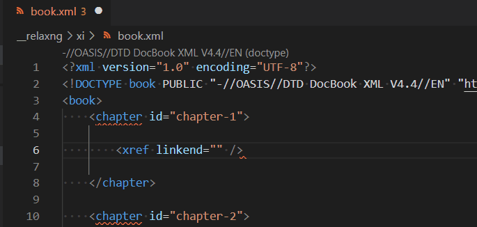

# XML References Features

## References

Given this [docbook](https://docbook.org/) XML file sample:

```xml
<?xml version="1.0" encoding="UTF-8"?>
<!DOCTYPE book PUBLIC "-//OASIS//DTD DocBook XML V4.4//EN" "http://www.docbook.org/xml/4.4/docbookx.dtd">
<book>
    <chapter id="chapter-1">

        <xref linkend="chapter-1" />

    </chapter>

    <chapter id="chapter-2">

    </chapter>
</book>
```

In this sample, `linkend` attribute in `<xref linkend="chapter-1" />` references the `chapter-1` declared in `<chapter id="chapter-1">`. [vscode-xml](https://github.com/redhat-developer/vscode-xml) provides a completion, definition, highlighting support to support this kind of references easily with the `xml.references` settings. For docbook case, you can declare this settings:

```json
  "xml.references": [
    {
      "pattern": "**/*.xml",
      "expressions": [
        {
          "from": "xref/@linkend",
          "to": "@id"
        }
      ]
    }
  ]
```

After saving this settings, you will enjoy with `completion, definition, highlighting` with `xref` docbook:



The `xml.references` settings is an array of reference which is declared with:

 * `pattern`:  matches the files that reference declared with `expressions` applies to. See [glob syntax](https://docs.oracle.com/javase/tutorial/essential/io/fileOps.html#glob) for more information about the pattern syntax. 
 * `expressions`: array of reference expression:
    * `prefix (optional)`: the prefix to use (ex : '#')  for from.
    * `from`: the from reference DOM node declared with XPath.
    * `to`: the to reference DOM node declared with XPath.
 
### prefix

Given this [TEI](https://tei-c.org/) XML file sample:

```xml
<?xml version="1.0" encoding="UTF-8"?>
<?xml-model href="http://www.tei-c.org/release/xml/tei/custom/schema/relaxng/tei_lite.rng" type="application/xml" schematypens="http://relaxng.org/ns/structure/1.0"?>
<TEI xmlns="http://www.tei-c.org/ns/1.0">
  <teiHeader>  
    <fileDesc>
      <titleStmt>
        <title>Title</title>
      </titleStmt>
      <publicationStmt>
        <p>Publication information</p>  
      </publicationStmt>
      <sourceDesc>
        <p>Information about the source</p>
      </sourceDesc>
    </fileDesc>
  </teiHeader>
  <text>
    <body xml:id="body-id">
      <p xml:id="p-id" >Some text here.</p>
      <anchor corresp="#body-id"></anchor>
    </body>
  </text>
</TEI>
```

In this sample, `corresp` attribute in `<anchor corresp="#body-id"></anchor>` references the `body-id` (without `#`) declared in `<body xml:id="body-id">`. It means that the `corresp` attribute value (with `#`) reference `@xml:id` attribute (without `#`). To support that, you can configure settings by using `prefix`:

```json
"xml.references": [
    {
      "pattern": "**/*.xml",
      "expressions": [
        {
          "prefix": "#",
          "from": "@resp",
          "to": "persName/@xml:id"
        },
        {
          "prefix": "#",
          "from": "@corresp",
          "to": "@xml:id"
        }
      ]
    }
  ]
```


### Limitation

XML references have some limitation:

 * `references works only for a given XML file`: it is not possible to reference some DOM nodes coming from another XML files. However if the file uses include (like xi:include) the reference should work for only the master file which include another file, but it will not work for the included file.
 * `multiple target is not supported`: if the `origin` attribute (which matches the `from` reference path) declares multiple targets  (which matches the `to` reference path), it will not work. 
 
 Given this XML file where `corresp` attribute defines several targets separated with whitespace (#body-id #p-id):
 
 ```xml
 <body xml:id="body-id">
   <p xml:id="p-id" >Some text here.</p>
   <anchor corresp="#body-id #p-id"></anchor>
 </body>
 ```
 
 This usecase is not supported today.
 
 If you need those support, please [create an issue](https://github.com/redhat-developer/vscode-xml/issues)