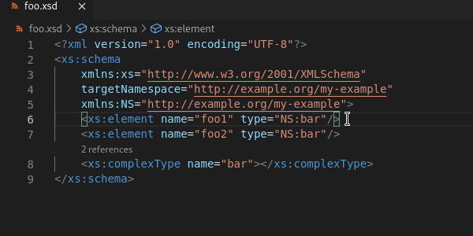
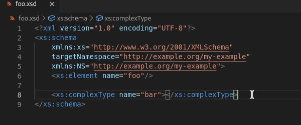
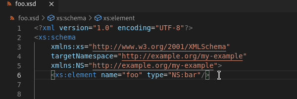
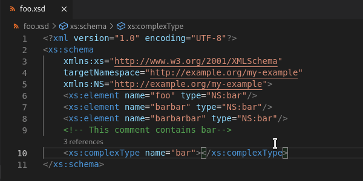
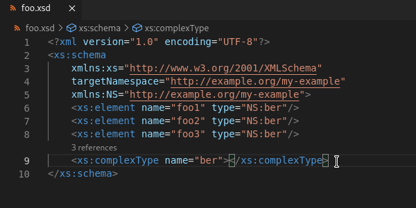
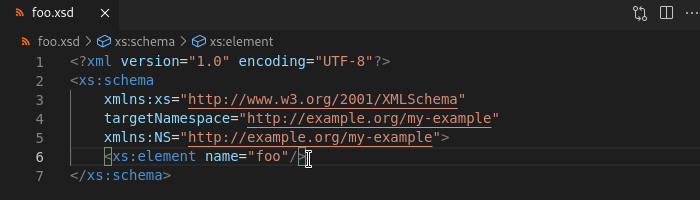

# XSD Features

## CodeLens Support

CodeLens is supported for `.xsd` files, which can show where a type is referenced.

This feature also supports listing the number of references to a type and the line(s) referenced on.

### Read more

See [CodeLens](../CodeLens.md#code-lens) for more details.

## XSD Tag Support

After defining a `Type` or `element` tag in the `.xsd` file, there are a number of features supported in relation to types/elements.

### Type completion

There is autocompletion support for assigning these types to element tags.

### Jump to type definition

For an `element` tag that is assigned a type, there is support for navigating to its definition from any type assignment.

### Highlight type instances

After defining a `Type` or `element`, selecting the `name` attribute will highlight all occurrences.

### Change all type occurrences

To rename a `Type` definition and its associated `element` `type` attribute values, highlight the `name` attribute of the `Type` and press `F2` or use the dropdown to select `Rename Symbol`.

## Syntax Validation

XSD syntax validation is enabled for any `.xsd` file.

### Validate element name with same type

Validation of `.xsd` files enforces all `element` tags that share a type to have different names.

### Validate type definition exists

Validation of `.xsd` files enforces all `element` tags to be assigned a type that has already been defined.

