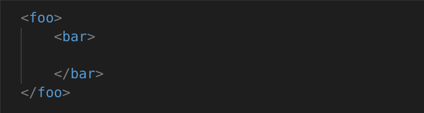
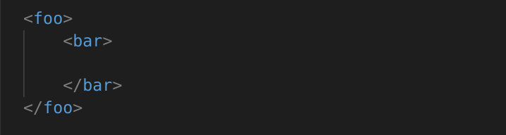

## Folding

### xml.folding.includeClosingTagInFold

When folding, the closing tag will remain unfolded by default.

To change this to minimize the closing tag within the fold, set folding.includeClosingTagInFold to `true`.

