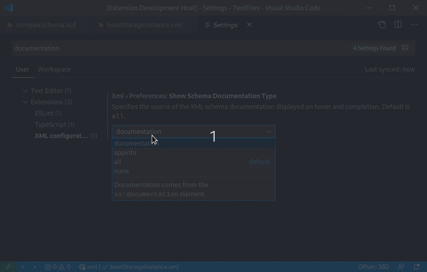

# Preferences

## Java Home

  If you are using vscode-xml in binary mode, without Java, you do not need to set your Java home.

  If you want to use Java to run vscode-xml, then you must configure which JRE or JDK to use.

  Ensure that the Java path is set in either:
  * `"xml.java.home"` in VSCode preferences
  * `"java.home"` in VSCode preferences
  * An environment variable `JAVA_HOME` or `JDK_HOME`

  Please note:
  * The path should end at the parent folder that contains the bin folder. As an example, use `/usr/lib/jvm/java-1.8.0` if the bin folder exists at `/usr/lib/jvm/java-1.8.0/bin`.
  * If the path is not set, the extension will attempt to find the path to the JDK or JRE.

## Server VM Arguments

  Can be accessed through `xml.server.vmargs`.

### Setting up Proxy

  A proxy can be defined in the following way if there is a system proxy:

  ```
  -Djava.net.useSystemProxies=true -Dhttp.proxyUser=<user> -Dhttp.proxyPassword=<password>
  ```

   or if there is not a system proxy:

  ```
  -Dhttp.proxyHost=<proxy_host> -Dhttp.proxyPort=<proxy_port> -Dhttp.proxyUser=<user>
  -Dhttp.proxyPassword= <password> -Dhttps.proxyHost=<proxy_host> -Dhttps.proxyPort=<proxy_port>
  ```

  **Please note:** If you've configured the proxy as described in [Proxy.md](Proxy.md), there is no need to do this,
  as this will be handled for you by vscode-xml.

## Server Binary Mode

  By default, if Java is not installed, a binary version of the LemMinX language server will be downloaded and run.
  If you want to use the binary version even if Java is installed, enable the `xml.server.preferBinary` option.
  If something goes wrong with downloading the binary, then vscode-xml will fall back to trying to use the Java server.

  Unfortunately, extensions to LemMinX such as lemminx-maven, liquibase-lsp, and lemminx-liberty cannot be used with the binary version of the server.
  vscode-xml will always launch the Java version of the server if extensions are detected and the user has Java installed.
  A warning will be displayed if you launch vscode-xml in binary server mode with extensions installed.
  This warning can be disabled with the `xml.server.silenceExtensionWarning` setting.
  Please see the [extensions page](Extensions.md#extensions) for more information.

  You can set a path for a custom binary with the `xml.server.binary.path` setting.

  Like with the Java version of the server, you can set memory limits and other command line arguments to the server through the `xml.server.binary.args` setting.
  These will take into effect after relaunching VSCode.
  Please refer to [this website for the available options](https://www.graalvm.org/reference-manual/native-image/HostedvsRuntimeOptions/).
  For example, you can increase the maximum memory that the server can use to 1 GB by adding `-Xmx1g`.

## Trusted binary hashes

  The `xml.server.binary.trustedHashes` setting contains a list of all the hashes of LemMinX (the XML language server) binaries that you have selected to trust.
  An entry will be added to this list every time you run an unrecognized binary and choose to trust and run it.
  If you use the `xml.server.binary.path` setting to set the path to a custom LemMinX binary,
  you can add the SHA256 hash of the binary as an entry in this list in order to prevent warnings about the binary not being recognized.

## Server Cache Path

  vscode-xml maintains a cache of the schemas (eg: XSD, DTD) that are referenced using an internet URL.
  For instance, if you have an XML document associated with a schema that is available at `http://example.org/schemas/projectFileSchema.xsd`,
  vscode-xml will store that schema on your computer in order to improve performance and avoid re-downloading the file.
  The default path of this cache is: `~/.lemminx`.

  Use the setting `xml.server.workDir` in order to set a custom path for this cache.
  The path must be absolute, and works with the '~' shortcut for the home directory.
  (eg: `~/cache/.lemminxCache`)

## File Associations

  Can be accessed through `xml.fileAssociations`.

  Provides ability to associate a schema with a file pattern.

  Example:
  ```json
  [
    {
     "systemId": "path/to/file.xsd",
     "pattern": "file1.xml"
    },
    {
     "systemId": "http://www.w3.org/2001/XMLSchema.xsd",
     "pattern": "**/*.xsd"
    }
  ]
  ```

Please see [XSD file associations](Validation.md#xml-file-association-with-xsd) and [DTD file associations](Validation.md#xml-file-association-with-dtd) for more information.

## Catalogs

  Can be accessed through `xml.catalogs`.

  Catalogs describe a mapping between external entity references and locally cached equivalents.

  The format should include local files and look like:

  ```json
  "catalogs": [
    "catalog.xml",
    "catalog2.xml"
  ]
  ```

Please see [XML catalog with XSD](Validation.md#XML-catalog-with-XSD) and [XML catalog with DTD](Validation.md#XML-catalog-with-DTD) for more information.

## Grammar

  Can be accessed through: `xml.problems.noGrammar`

  When there are issues with grammar constraints like (Catalogs or Associations not properly configured)
  you can set message severity of the message the client will receive.

  Options:

*  ignore
*  hint **(default)**
*  info
*  warning
*  error

## Formatting

See the [Formatting page](Formatting.md#formatting).

## Code Lens

Use `xml.codeLens.enabled` in order to enable or disable code lens. Please see [the Code Lens page](CodeLens.md#code-lens) for more information.

## Tag Auto Closing

The closing tags for elements should automatically be added when typing `>` to complete an opening tag.

For instance, if you type `>` when your cursor is placed at the `|` pipe in the following code:

```xml
<root>
  <child|
</root>
```

Then the closing tag for the `<child>` element will automatically be inserted:

```xml
<root>
  <child></child>
</root>
```

Similarly, the closing tag will be automatically completed when typing `</` to start a closing tag.

### Auto Close Removes Content

The `xml.completion.autoCloseRemovesContent` setting controls if all content inside an element gets deleted when the start tag gets changed to a self-closing tag.

For instance if `xml.completion.autoCloseRemovesContent` is set to `true`, in the following code:

```xml
<root |
  <child />
  content
</root>
Orphaned text
<orphaned-element />
```

If `/` is typed at the pipe (`|`), then `/>` will be inserted at the cursor,
and `<child />` and `content` will be removed.
Note that `Orphaned text` and `<orphaned-element />` will be preserved.

If `xml.completion.autoCloseRemovesContent` is set to `false` in this case,
`/>` is inserted at the cursor, but no content will be removed.

Unfortunately, this only works if the first content inside the element is an element.
For instance, if you typed `/` at the `|` for this document:

```xml
<root>
  <container |
    text content
    <child />
  </container>
</root>
```

it gets turned into the following (no auto completion):

```xml
<root>
  <container /
    text content
    <child />
  </container>
</root>
```

The same result would occur for the previous example if `xml.completion.autoCloseRemovesContent` is set to `false`.

By default, `xml.completion.autoCloseRemovesContent` is set to `true`.

## Documentation Type

Use `xml.preferences.showSchemaDocumentationType` in order to control which documentation is presented during completion and hover for XML documents associated with XSD schemas.
When you hover over an element in an XML document, the documentation is pulled from the `xs:documentation` and `xs:appinfo` elements. These elements are nested under the definition of the hovered element in the schema.

As an example, here is a schema with documentation:

```xml
<xs:schema
    xmlns:xs="http://www.w3.org/2001/XMLSchema"
    xmlns="http://example.org/schema/complexSchema"
    targetNamespace="http://example.org/schema/complexSchema">
  <xs:simpleType name="color">
    <xs:restriction base="xs:string">
      <xs:pattern value="[0-9A-F]{6}" />
    </xs:restriction>
  </xs:simpleType>
  <xs:element name="boot">
    <xs:complexType>
      <xs:sequence>
        <xs:element name="size" type="xs:positiveInteger">
          <xs:annotation>
            <xs:appinfo>Used to distinguish boots of different sizes</xs:appinfo>
            <xs:documentation>The size of the boot</xs:documentation>
            <xs:documentation>This number is not based on metric or imperial units of measurement</xs:documentation>
          </xs:annotation>
        </xs:element>
        <xs:element name="color" type="color">
          <xs:annotation>
            <xs:appinfo>Used to accurately display the boots color</xs:appinfo>
            <xs:documentation>The color of the boot as an RBG hexadecimal number</xs:documentation>
          </xs:annotation>
        </xs:element>
      </xs:sequence>
    </xs:complexType>
  </xs:element>
  <xs:element name="root">
    <xs:annotation>
      <xs:appinfo>Contains the boots</xs:appinfo>
      <xs:documentation>Holds zero or more boots</xs:documentation>
    </xs:annotation>
    <xs:complexType>
      <xs:sequence>
        <xs:element ref="boot" minOccurs="0" maxOccurs="unbounded" />
      </xs:sequence>
    </xs:complexType>
  </xs:element>
</xs:schema>
```

The different options are:
 * `documentation`: Show only the content of `xs:documentation` elements
 * `appinfo`: Show only the content of `xs:appinfo` elements
 * `all`: Show the content of `xs:appinfo` and `xs:documentation`, separated by subtitles
 * `none`: Neither `xs:appinfo` nor `xs:documentation` are shown.

Here is a demonstration of the effects of the setting on hovering. The above schema is used in the example:



## Extension JARs

The LemMinX XML Language Server can be extended with custom plugins to provide additional validation and assistance.
Typically this is done for specific files or contexts.
External extensions are are contributed via an external JAR.
Please see [the extension development documentation](https://github.com/eclipse/lemminx/blob/main/docs/LemMinX-Extensions.md) for more information on how this works.

JARs can be contributed to the LemMinX classpath using the `xml.extension.jars` preference.
These paths can include globs.
This feature is only intended to be used for LemMinX extension development purposes.
Distributing vscode-xml extensions is best done through the mechanism described in the
[vscode-xml extension development documentation](Extensions.md#custom-xml-extensions).
