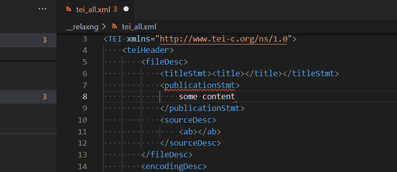
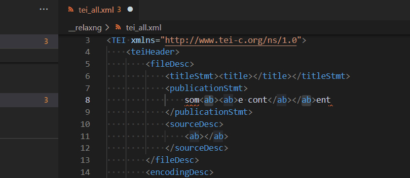
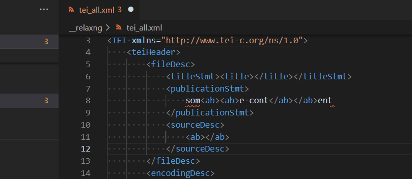

# Refactor

## Surround with Tags (Wrap)

This refactor command gives the capability to select an XML content and surround it with a given tag. To execute this command you can:

 * use command palette (`Ctrl+P`) and type `Surround`

 * use contextual menu

If you prefer using keyboard to process `Surround with Tags (Wrap)`,you need to associate this command with a keybinding. See [Keyboard Shortcuts editor](https://code.visualstudio.com/docs/getstarted/keybindings#_keyboard-shortcuts-editor) for more informations.

## Surround with Comments

Similar to `Surround with Tags (Wrap)`, you can comment out the selected XML content:

## Surround with CDATA

Similar to `Surround with Tags (Wrap)`, you can surround the selected XML content with CDATA:

