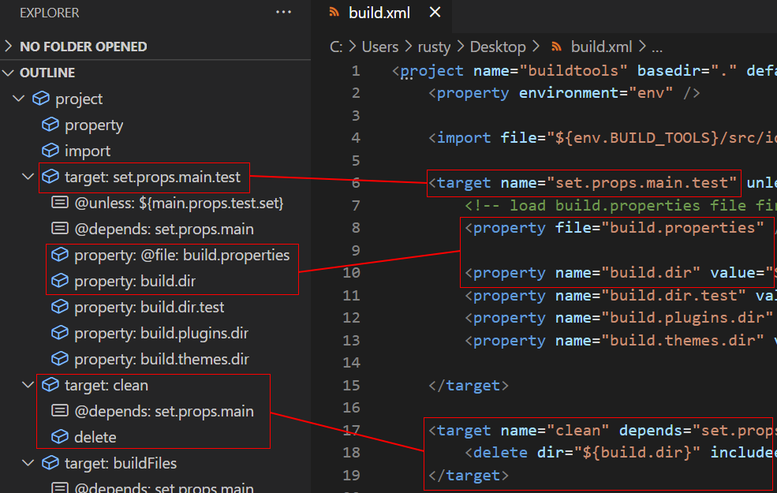

# Symbols

## xml.symbols.enabled

Enable/disable document symbols (Outline). Default is `true`. No symbols are given if `\"xml.symbols.enabled\": false`.

## xml.symbols.maxItemsComputed

Use `xml.symbols.maxItemsComputed` to limit the number of symbols that are computed for each XML document.
This helps to prevent cases where the extension runs out of memory on large documents.
This limit can also improve performance on large documents.

The default limit is 5000.
If the limit is set to 0, no symbols are computed.
If the limit is set to a negative number, all the symbols will be computed.

If [xml.symbols.showReferencedGrammars](#xmlsymbolsshowreferencedgrammars) is enabled, the referenced grammar symbols are included in the count.
If symbols are disabled, this setting has no effect.

## xml.symbols.showReferencedGrammars

If `xml.symbols.showReferencedGrammars` is enabled, the referenced grammars will be listed in the document outline.
The following are also listed:
 * The association method for each grammar
 * If the grammar is in the cache. Remote grammars are cached by default. Please refer to the [server cache path documentation](Preferences.md#server-cache-path) for more information.


This option has no effect if symbols are disabled through [xml.symbols.enabled](#xmlsymbolsenabled).
The displayed symbols are affected by [xml.symbols.maxItemsComputed](#xmlsymbolsmaxitemscomputed)

## xml.symbols.filters

By default Outline (symbols) display `DOM elements`, `processing instruction`, `DTD element`, `entity` and, `attribute list declarations`.

The `DOM attributes` and `text nodes` are not displayed in the outline. Indeed to ensure good performance, symbols must be limited; displaying attributes and text nodes in the outline could generate a lot of symbols.

Here a sample Outline with maven `pom.xml`:


In maven context, the text nodes information are important and we should prefer showing text nodes in the Outline:


In Spring context, the `@id` attribute information are important and we should prefer showing those attributes in the Outline:


In other words, displaying attributes or text nodes depends on the XML file.

`xml.symbols.filters` gives the capability to define filters (to include or exclude) some attributes, some text nodes for a given XML file kind.

Symbols filter are composed with:

* `pattern` (required) : a regular expression matching the file names to which this filter should apply.
* `expressions` (required) : defines a list of expressions. An expression is composed of:
  *  `xpath` (required) : defines a basic xpath to declare the attribute or the text node which is concerned by the expression (see [XPath expression](#xpath-expression) below).
  *  `excluded` (optional): true if the node which matches the xpath must be excluded or not. By default, `excluded` is set to false.
  *  `inlineAttribute` (optional): defines that an attribute expression should be displayed inline with its owning element instead of being nested. By default this is set to false. (see [For Ant/Phing build.xml](#antPhingXmlExample) example below).
  *  `showAttributeName` (optional): defines that an attribute expression name should be displayed along with its value. Note that this only applies to `inlineAttributes`. Nested attributes always show their name and value to help distinguish them from other child nodes. By default this is set to false. (see [For Ant/Phing build.xml](#antPhingXmlExample) example below).

The order of the expression item are important, because each expression are applied by using the order of the expressions array.

NOTE: when you change `xml.symbols.filters` in `settings.json`, the Outline is not refreshed automatically (see vscode [vscode issue 108722](https://github.com/microsoft/vscode/issues/108722)). You must refresh at hand the Outline by updating the XML file or closing/opening the XML file.

NOTE: when you define your own patterns in `settings.json`, it might be necessary to define the glob pattern that crosses directory boundaries `**` for the matching to occur. See [vscode-xml issue 684](https://github.com/redhat-developer/vscode-xml/issues/684) for more detail. For example, when applying this to XML and BPML files this might be necessary: `"pattern": "**/*.{bpml,xml}",` 

### Filter samples

#### Text nodes sample

For `pom.xml`, to obtain this Outline:


you must declare this filter in the settings.json:

```json
"xml.symbols.filters": [
   // Declaration of symbols filter for maven 'pom.xml' to show all text nodes in the Outline.
   {
      "pattern": "pom.xml",
      "expressions" :[
         {
            "xpath": "//text()"
         }
      ]
   }
]
```

#### Attributes samples

For Spring `beans.xml`, to obtain this Outline:


you must declare this filter in the settings.json:

```json
"xml.symbols.filters": [
   // Declaration of symbols filter for Spring beans to show all @id of the elements in the Outline.
   {
      "pattern": "bean*.xml",
      "expressions" :[
         {
            "xpath": "//@id"
         }
      ]
   }
]
```

<span id='antPhingXmlExample'>For Ant/Phing</span> `build.xml` with inline attributes, to obtain this Outline:



you must declare this filter in the settings.json:

```json
"xml.symbols.filters": [
   // Declaration of symbols filter for Ant/Phing build.xml to show all @name attributes
   // for target elements and @name and @file attributes of properties elements in the Outline.
   {
      "pattern": "build*.xml",
      "expressions" :[
         {
            // keep the value of the attribute "name" on the same line
            // as the "target" element, and don't show the attribute name
            "xpath": "//target/@name",
            "inlineAttribute" : true,
            "showAttributeName": false
         },
         // show "unless" and "depends" as nested attributes for
         // "target" elements
         {
            "xpath": "//target/@unless"
         },
         {
            "xpath": "//target/@depends"
         },
         {
            // keep the value of the attribute "name" on the same line
            // as the "property" element, and don't show the attribute name
            "xpath": "//property/@name",
            "inlineAttribute" : true,
            "showAttributeName": false
         },
         {
            // keep the value of the attribute "file" on the same line
            // as the "property" element, and show the attribute name
            // along with the value to distinguish it from the more common
            // "name" attribute
            "xpath": "//property/@file",
            "inlineAttribute" : true,
            "showAttributeName": true
         }
      ]
   }
]
```

#### Exclude sample

If you want to define a filter which `includes all attributes except the optional attribute`, you can write the filter like this:

```json
"xml.symbols.filters": [
   // Declaration of symbols filter for Spring beans to show all @id of the elements in the Outline.
   {
      "pattern": "foo*.xml",
      "expressions" :[
         // Exclude optional attribute 
         {
            "xpath": "//@optinal"
            "excluded": true
         },
         // Include other attributes
         {
            "xpath": "//@*",
         }
      ]
   }
]
```

An another sample of exclusion is when you have a large XML file and you want to show a part of the XML content. You can exclude some elements with xpath.

```json
"xml.symbols.filters": [
   // Declaration of symbols filter to exclude description elements and their children in the Outline.
   {
      "pattern": "file*.xml",
      "expressions" :[
         {
            "xpath": "//description",
            "excluded": true
         }
      ]
   }
]
```

### XPath expression

The syntax of XPath expression are basic and doesn't support advanced XPath expression.

Here some sample for attribute XPath expression:

* `//@*` : display all attributes.
* `//@id` : display all ID attribute.
* `//bean/@id` : display ID attribute only for all bean element.
* `//beans/bean/@id` : display ID attribute only for bean element which have beans parent element.
* `//beans/bean[@name='ABCD']/@id` : display ID attribute only for bean element which have beans parent element and which have a name attribute equals to ABCD.
* `//beans/bean[@name='ABCD'][@name2='ABCD']/@id` : display ID attribute only for bean element which have beans parent element and which have a name and name2 attributes equals to ABCD.
   
Here some sample for text XPath expression:
  
* `//text()` : display all text nodes.
* `//bean/text()` : display text node only for bean element.
* `//beans/bean/text()` : display text node only for bean element which have beans parent element.
