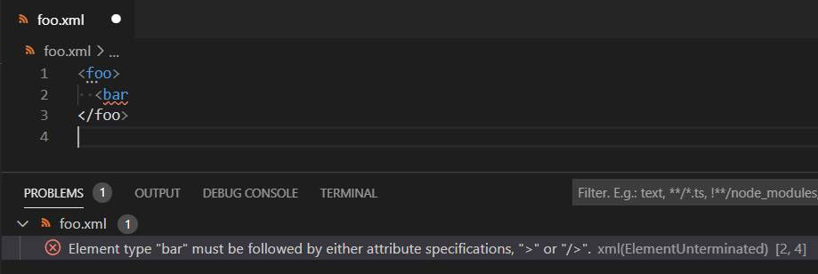
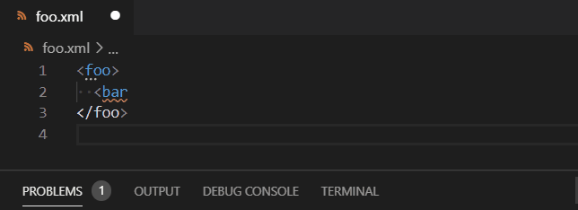
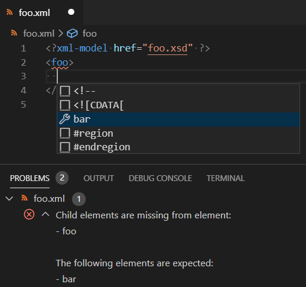
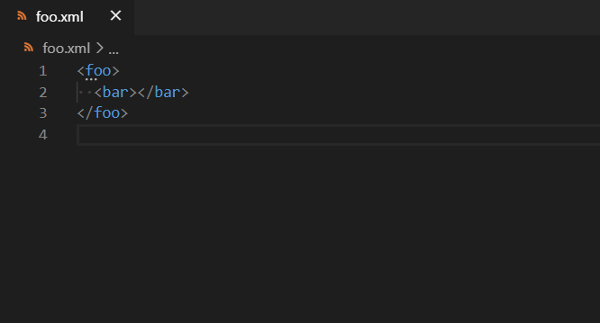
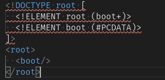
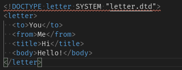

# XML Validation

## XML Syntax Errors

[vscode-xml](https://github.com/redhat-developer/vscode-xml) provides the capability to `report XML syntax errors` when the XML is not valid:



For many of the errors, you can use a `Quick Fix` (code action) to help you fix the XML:



## Validation with a given grammar

You can `validate your XML with a grammar` (XSD, DTD). In order to do so, you must associate your XML document with a grammar. Once you have done this, you will benefit from:

 * XML `validation` based on the grammar.
 * XML `completion` based on the grammar.
 * XML `hover` based on the grammar in order to show the documentation.

If the `xml.symbols.showReferencedGrammars` setting is enabled, the method used to associate each grammar is listed in the document symbols.
Please see the [Show Referenced Grammars documentation](Symbols.md#show-referenced-grammars) for more information.

## Validation with XSD grammar

In the following sections, we would like to validate the XML `foo.xml` file:

```xml
<foo>
  <bar />
</foo>
```

with the XSD `foo.xsd` file (in the same folder as foo.xml) :

```xml
<?xml version="1.0" encoding="UTF-8"?>
<xs:schema xmlns:xs="http://www.w3.org/2001/XMLSchema">
  <xs:element name="foo">
    <xs:complexType>
      <xs:sequence>
        <xs:element name="bar" />
      </xs:sequence>
    </xs:complexType>
  </xs:element>
</xs:schema>
```

in order to benefit from validation, completion, and hover based on the XSD:



To associate your XML document with an XSD grammar, you can use several strategies:

 * [xsi:noNamespaceSchemaLocation](#xsinonamespaceschemalocation)
 * [xsi:schemaLocation](#xsischemalocation)
 * [xml-model with XSD](#xml-model-with-XSD) processing instruction
 * [XML catalog with XSD](#XML-catalog-with-XSD)
 * [XML file association](#XML-file-association-with-xsd)

If you have an XML without an XSD, you can generate the XSD with a `Quick Fix` (code action):



The Quick Fix will generate the XSD file and associate the XML with the XSD using the chosen strategy.

### xsi:noNamespaceSchemaLocation

To bind the XML file `foo.xml` with the XSD file `foo.xsd`, you can use the `xsi:noNamespaceSchemaLocation` strategy like this:

```xml
<foo
    xmlns:xsi="http://www.w3.org/2001/XMLSchema-instance"
    xsi:noNamespaceSchemaLocation="foo.xsd">
  <bar />
</foo>
```

### xsi:schemaLocation

The `xsi:schemaLocation` strategy is used when the XML document defines a namespace and the elements in the document are associated with that namespace:

```xml
<foo xmlns="http://foo"
    xmlns:xsi="http://www.w3.org/2001/XMLSchema-instance"
    xsi:schemaLocation="http://foo foo.xsd">
  <bar />
</foo>
```

In this case, the corresponding XSD file defines `targetNamespace="http://foo"` in the root element of the XSD:

```xml
<?xml version="1.0" encoding="UTF-8"?>
<xs:schema
    xmlns:xs="http://www.w3.org/2001/XMLSchema"
    elementFormDefault="qualified"
    targetNamespace="http://foo">
  <xs:element name="foo">
    <xs:complexType>
      <xs:sequence>
        <xs:element name="bar" />
      </xs:sequence>
    </xs:complexType>
  </xs:element>
</xs:schema>
```


### xml-model with XSD

To bind the XML file `foo.xml` to the XSD file `foo.xsd`, you can use [xml-model](https://www.w3.org/TR/xml-model/) processing instruction strategy like this:

```xml
<?xml-model href="foo.xsd" ?>
<foo>
  <bar />
</foo>
```

### XML catalog with XSD

Using an XML catalog can be helpful when you wish to use elements from a namespace but don't want to set the real path of the XSD file for each XML document.

In other words you want to write this XML file:

```xml
<foo xmlns="http://foo" >
  <bar />
</foo>
```

and validate it with the `foo.xsd` XSD file:

```xml
<?xml version="1.0" encoding="UTF-8"?>
<xs:schema
    xmlns:xs="http://www.w3.org/2001/XMLSchema"
    elementFormDefault="qualified"
    targetNamespace="http://foo">
  <xs:element name="foo">
    <xs:complexType>
      <xs:sequence>
        <xs:element name="bar" />
      </xs:sequence>
    </xs:complexType>
  </xs:element>
</xs:schema>
```

To do this, you need to write an XML catalog, and an entry for the XSD. In this example, we'll name the catalog `catalog.xml`. The catalog looks like this:

```xml
<catalog xmlns="urn:oasis:names:tc:entity:xmlns:xml:catalog">

  <uri
      name="http://foo"
      uri="./foo.xsd" />

</catalog>
```

You must register your `catalog.xml` in the vscode `settings.json` like this:

```json
"xml.catalogs": [
   "catalog.xml"
]
```

You can also register the catalog using its absolute path:

| Windows                            | MacOS                        | Linux                       |
| ---------------------------------- | ---------------------------- | --------------------------- |
| `C:\\Users\\path\\to\\catalog.xml` | `/Users/path/to/catalog.xml` | `/home/path/to/catalog.xml` |

Please note that you can declare your catalog path with `file:///` if you need it.

Another useful option are the rewrite rules. Given the same xml as before but now with `xmlns="http://foo.web/foo/types.xsd"` can be adjusted to use a local `types.xsd` as follows:

```xml
<catalog xmlns="urn:oasis:names:tc:entity:xmlns:xml:catalog">

  <rewriteURI
      uriStartString="http://foo.web/foo/"
      rewritePrefix="./" />

</catalog>
```


### XML file association with XSD

You can use the XML file association strategy to bind the XML file `foo.xml` with the XSD file `foo.xsd` by adding the following into your vscode `settings.json`:

```json
"xml.fileAssociations": [
   {
       "pattern": "foo.xml",
       "systemId": "foo.xsd"
   }
]
```

Please note that you can use wildcards in the pattern (ex: `foo*.xml`):

```json
"xml.fileAssociations": [
   {
       "pattern": "foo*.xml",
       "systemId": "foo.xsd"
   }
]
```

In this case, all XML files that start with foo and end with .xml will be associated with the XSD (foo1.xml, foo2.xml, etc)

You can also use the following three variables in either the `pattern` or `systemId`:

 | Variable                    | Meaning                                                                  |
 | --------------------------- | ------------------------------------------------------------------------ |
 | ${workspaceFolder}          | The absolute path to root folder of the workspace that is currently open |
 | ${fileDirname}              | The absolute path to the folder of the file that is currently opened     |
 | ${fileBasenameNoExtension}  | The current opened file's basename with no file extension                |

If one of the variables for an association can't be expanded (eg. because vscode is opened in rootless mode),
the association is ignored.
This feature is specific to the VSCode client.

Please note that if the XSD defines a `targetNamespace="http://foo"` like the following `foo.xsd` XSD file:

```xml
<?xml version="1.0" encoding="UTF-8"?>
<xs:schema
    xmlns:xs="http://www.w3.org/2001/XMLSchema"
    elementFormDefault="qualified"
    targetNamespace="http://foo">
  <xs:element name="foo">
    <xs:complexType>
      <xs:sequence>
        <xs:element name="bar" />
      </xs:sequence>
    </xs:complexType>
  </xs:element>
</xs:schema>
```

the following XML file association:

```json
"xml.fileAssociations": [
   {
       "pattern": "foo*.xml",
       "systemId": "foo.xsd"
   }
]
```

will work with the following `foo.xml` XML file only if it declares the `http://foo` namespace:

```xml
<foo xmlns="http://foo" >
  <bar />
</foo>
```

## Validation with DTD grammar

To associate your XML with a DTD grammar you can use several strategies:

 * [DOCTYPE](#DOCTYPE)
 * [xml-model with DTD](#xml-model-with-DTD) processing instruction
 * [XML catalog with DTD](#XML-catalog-with-DTD)
 * [XML file association with DTD](#xml-file-association-with-DTD)

In the following sections we would like to validate the XML `foo.xml` file:

```xml
<foo>
  <bar />
</foo>
```

with the DTD `foo.dtd` file:

```xml
<!ELEMENT foo (bar)>
<!ELEMENT bar EMPTY>
```

Please note: this DTD file can be generated with the same Quick Fix which generates the XSD.

### DOCTYPE

To bind the XML file `foo.xml` with the DTD file `foo.dtd`, you can use the `DOCTYPE` strategy like this:

```xml
<!DOCTYPE foo SYSTEM "foo.dtd">
<foo>
  <bar />
</foo>
```

### xml-model with DTD

To bind XML file `foo.xml` with the DTD file `foo.dtd`, you can use [xml-model](https://www.w3.org/TR/xml-model/) processing instruction strategy like this:

```xml
<?xml-model href="foo.dtd" ?>
<foo>
  <bar />
</foo>
```

### XML catalog with DTD

Using an XML catalog can be helpful when you wish to associate to a DTD using a PUBLIC declaration, but don't want to set the real path of the DTD file (SYSTEM).

In other words you want to write this XML file:

```xml
<!DOCTYPE foo PUBLIC "-//FOO" "XXXXXXXXXXXXXXX.dtd">
<foo>
  <bar />
</foo>
```

and validate it with this `foo.dtd` DTD file:

```xml
<!ELEMENT foo (bar)>
<!ELEMENT bar EMPTY>
```

The declared `XXXXXXXXXXXXXXX.dtd` in the DOCTYPE is a file which doesn't exist. The `foo.dtd` will be retrieved using the PUBLIC `-//FOO`.

To do this, you need to write an XML catalog, and an entry for the DTD. In this example, we'll name the catalog `catalog.xml`. The catalog looks like this:

```xml
<catalog xmlns="urn:oasis:names:tc:entity:xmlns:xml:catalog">

  <public
      publicId="-//FOO"
      uri="./foo.dtd" />

</catalog>
```

and in vscode `settings.json` you must register your `catalog.xml` like this:

```json
"xml.catalogs": [
   "catalog.xml"
]
```

You can also register the catalog using its absolute path:

| Windows                            | MacOS                        | Linux                       |
| ---------------------------------- | ---------------------------- | --------------------------- |
| `C:\\Users\\path\\to\\catalog.xml` | `/Users/path/to/catalog.xml` | `/home/path/to/catalog.xml` |


### XML file association with DTD

You can use the XML file association strategy to bind the XML file `foo.xml` with the DTD file `foo.dtd` by adding the following into your vscode `settings.json`:

```json
"xml.fileAssociations": [
  {
      "pattern": "foo.xml",
      "systemId": "foo.dtd"
  }
]
```

Please note that you can use wildcards in the pattern (ex: `foo*.xml`):

```json
"xml.fileAssociations": [
  {
      "pattern": "foo*.xml",
      "systemId": "foo.dtd"
  }
]
```

In this case, all XML files that start with foo and end with .xml will be associated with the DTD (foo1.xml, foo2.xml, etc)

You can also use the following three variables in either the `pattern` or `systemId`:

 | Variable                    | Meaning                                                                  |
 | --------------------------- | ------------------------------------------------------------------------ |
 | ${workspaceFolder}          | The absolute path to root folder of the workspace that is currently open |
 | ${fileDirname}              | The absolute path to the folder of the file that is currently opened     |
 | ${fileBasenameNoExtension}  | The current opened file's basename with no file extension                |

If one of the variables for an association can't be expanded (eg. because vscode is opened in rootless mode),
the association is ignored.
This feature is specific to the VSCode client.

# Other Validation Settings

## Disallow Doc Type Declarations

If `xml.validation.disallowDocTypeDeclaration` is set to `true` (default is `false`), all Doc Type Declarations (DTD) will be marked as errors. The DOCTYPE is marked as an error regardless if the doctype is an internally declared or a reference to an external DTD. Standalone `.dtd` files are not marked as an error.

Here are some examples of files with `xml.validation.disallowDocTypeDeclaration` set to true:





## Resolve External Entities

If `xml.validation.resolveExternalEntities` is set to `true` (default is `false`), then the value of [external entities](https://www.w3schools.com/xml/xml_dtd_entities.asp) are resolved for validation. This means that the file referenced in the external entity declaration will be downloaded. The default is `false` due to [the xml external entity attack](https://en.wikipedia.org/wiki/XML_external_entity_attack).

In an untrusted workspace, this feature is disabled.

Demonstration of the different behaviour:


## xml.validation.namespaces.enabled

The `xml.validation.namespaces.enabled` gives the capability to enable / disable the namespaces (prefix) validation. It can be configured with 3 values:

 * `always`: enable schema based validation.
 * `never`: disable schema based validation.
 * `onNamespaceEncountered`: enable namespaces validation only when the root element declares an xmlns namespace.

To understand the `onNamespaceEncountered` settings value, lets go through an example:

Create the XML `foo.xml` file:

```xml
<foo>
	<p:bar />
</foo>
```

In `always` you will have error, in `onNamespaceEncountered` you will have none error.

Declares a namespaces in the foo root element:

```xml
<foo xmlns="http:foo" >
	<p:bar />
</foo>
```

In `onNamespaceEncountered` you will see a prefix error.

## xml.validation.schema.enabled

The `xml.validation.schema.enabled` gives the capability to enable / disable the validation based on XSD. It can be configured with 3 values:

 * `always`: enable schema based validation.
 * `never`: disable schema based validation.
 * `onValidSchema`: enable schema based validation only when the declared xsi:schemaLocation hint or xsi:noNamespaceSchemaLocation is valid for the root element.

To understand the `onValidSchema` settings value, lets go through an example:

Create the XML `foo.xml` file:

```xml
<foo xmlns="http://foo"
	xmlns:xsi="http://www.w3.org/2001/XMLSchema-instance"
	xsi:schemaLocation="
		http://foo foo.xsd">
	<bar />
	<BAD_ELEMENT />
</foo>
```

Create the XSD `foo.xsd` file (in the same folder as foo.xml) :

```xml
<?xml version="1.0" encoding="UTF-8"?>
<xs:schema xmlns:xs="http://www.w3.org/2001/XMLSchema">
  <xs:element name="foo">
    <xs:complexType>
      <xs:sequence>
        <xs:element name="bar" />
      </xs:sequence>
    </xs:complexType>
  </xs:element>
</xs:schema>
```

In the XML file, the `BAD_ELEMENT` is higlighted as an error. Update the xsi:schemaLocation with bad namespace hint

```xml
<foo>
...
	xsi:schemaLocation="
		http://bad-foo foo.xsd">
...
</foo>
```

In `always` you will have error, in `onValidSchema` you will have none error.

Now, update the xsi:schemaLocation with bad location hint

```xml
<foo>
...
	xsi:schemaLocation="
		http://foo bad-foo.xsd">
...
</foo>
```

In `always` you will have error, in `onValidSchema` you will have none error.
